<script type="text/javascript">
  window.MathJax = {
    tex: {
      inlineMath: [['$', '$'], ['\\(', '\\)']],
      displayMath: [['$$', '$$'], ['\\[', '\\]']]
    },
    svg: {
      fontCache: 'global'
    }
  };
</script>
<script type="text/javascript" async src="https://cdn.jsdelivr.net/npm/mathjax@3/es5/tex-mml-chtml.js"></script>
<style>
:root {
    color-scheme: light;
    --bg-color: #ffffff;
    --fg-color: #24292e;
    --muted-color: #57606a;
    --accent-color: #126fdaff;
    --border-color: #d0d7de;
    --mono: "SFMono-Regular", Consolas, "Liberation Mono", Menlo, monospace;
    --sans: -apple-system, BlinkMacSystemFont, "Segoe UI", Helvetica, Arial, sans-serif, "Apple Color Emoji", "Segoe UI Emoji";
}

body {
    background: var(--bg-color);
    color: var(--fg-color);
    font-family: var(--sans);
    font-size: 1.1rem;
    line-height: 1.6;
    margin: 0 auto;
    max-width: 980px;
    padding: 45px 32px 64px;
}

@media (max-width: 768px) {
    body {
        padding: 32px 18px 48px;
    }
}

a {
    color: var(--accent-color);
    text-decoration: none;
}

a:hover,
a:focus {
    text-decoration: underline;
}

p {
    margin: 0 0 16px;
}

ul,
ol {
    margin: 0 0 16px 24px;
    padding-left: 24px;
}

li + li {
    margin-top: 0.25em;
}

blockquote {
    border-left: 0.25em solid var(--border-color);
    color: var(--muted-color);
    margin: 0 0 16px;
    padding: 0 1em;
}

.note-callout {
    margin: 24px 0;
    padding: 18px 20px;
    border-radius: 8px;
    border: 1px solid rgba(36, 41, 46, 0.12);
    background: rgba(69, 76, 83, 0.06);
    color: var(--fg-color);
    box-shadow: 0 6px 20px rgba(18, 111, 218, 0.08);
}

.note-callout strong {
    text-transform: uppercase;
    letter-spacing: 0.08em;
    font-size: 0.85rem;
    color: rgba(1, 15, 31, 0.85);
}

hr {
    border: 0;
    border-bottom: 1px solid var(--border-color);
    margin: 24px 0;
    height: 0;
}

pre {
    background: #f6f8fa;
    border: 1px solid var(--border-color);
    border-radius: 6px;
    box-shadow: none;
    padding: 16px;
    overflow: auto;
    margin: 24px 0;
    font-size: 0.9rem;
    line-height: 1.45;
}

pre code {
    background: transparent;
    color: #1f2933;
    font-family: var(--mono);
    font-size: 0.9rem;
    line-height: 1.45;
}

code {
    font-family: var(--mono);
    background: rgba(31, 41, 55, 0.08);
    padding: 0.2em 0.4em;
    border-radius: 6px;
    font-size: 0.9rem;
    color: #1f2933;
}

pre code .token.keyword,
code .token.keyword {
    color: #d12f6a;
    font-weight: 600;
}

pre code .token.function,
code .token.function {
    color: #1d4ed8;
}

pre code .token.string,
code .token.string {
    color: #057a55;
}

pre code .token.comment,
code .token.comment {
    color: #6b7280;
    font-style: italic;
}

pre code .token.number,
code .token.number,
pre code .token.constant,
code .token.constant {
    color: #b45309;
}

pre code .token.operator,
code .token.operator,
pre code .token.punctuation,
code .token.punctuation {
    color: #334155;
}

h1,
h2,
h3,
h4,
h5,
h6 {
    font-weight: 600;
    line-height: 1.25;
    margin-top: 32px;
    margin-bottom: 16px;
}

h1,
h2 {
    border-bottom: 1px solid var(--border-color);
    padding-bottom: 0.3em;
}

h1 {
    font-size: 2em;
}

h2 {
    font-size: 1.5em;
}

h3 {
    font-size: 1.25em;
}

h4 {
    font-size: 1em;
}

h5 {
    font-size: 0.875em;
}

h6 {
    font-size: 0.85em;
    color: var(--muted-color);
}

table {
    border-collapse: collapse;
    margin: 0 0 24px;
    width: 100%;
}

th,
td {
    border: 1px solid var(--border-color);
    padding: 8px 12px;
    text-align: left;
}

img,
video {
    display: block;
    max-width: 100%;
    height: auto;
    margin: 24px 0;
}

div[align="center"] img,
div[align="center"] video {
    margin-left: auto;
    margin-right: auto;
}

figure {
    margin: 0 0 16px;
}

figcaption {
    color: var(--muted-color);
    font-size: 0.9rem;
    margin-top: 8px;
    text-align: center;
}

.profiling-grid {
    display: flex;
    flex-wrap: wrap;
    gap: 24px;
    margin: 32px 0;
}

.profiling-item {
    flex: 1 1 240px;
}

.profiling-item h4 {
    margin: 0 0 12px;
    text-align: center;
}

.profiling-item img {
    max-width: 100%;
    margin: 0 auto;
}

.image-row {
    display: flex;
    justify-content: center;
    align-items: flex-start;
    gap: 24px;
    margin: 24px 0 32px;
}

.image-row figure {
    margin: 0;
}

.image-row img {
    width: 100%;
    height: auto;
}

.image-row.image-row--narrow figure {
    flex: 0 0 220px;
    max-width: 220px;
}

.image-row.image-row--narrow img {
    width: 100%;
}

@media (max-width: 720px) {
    .image-row.image-row--narrow figure {
        flex: 1 1 100%;
        max-width: 100%;
    }
}

.toc-wrapper {
    float: left;
    width: 240px;
    margin: 8px 48px 32px -220px;
    padding-left: 16px;
    border-left: 2px solid rgba(36, 41, 46, 0.2);
    font-family: var(--sans);
    font-size: 0.95rem;
    line-height: 1.5;
}

.toc-title {
    margin: 0 0 16px;
    text-transform: uppercase;
    letter-spacing: 0.24em;
    font-size: 0.85rem;
    color: rgba(36, 41, 46, 0.55);
    font-weight: 600;
}

.toc-list,
.toc-sublist,
.toc-subsublist {
    list-style: none;
    margin: 0;
    padding: 0;
}

.toc-list {
    counter-reset: toc-section;
    display: flex;
    flex-direction: column;
    gap: 12px;
}

.toc-list > li {
    counter-increment: toc-section;
    counter-reset: toc-subsection;
}

.toc-sublist {
    counter-reset: toc-subsection;
    margin: 8px 0 0 18px;
    display: flex;
    flex-direction: column;
    gap: 8px;
}

.toc-sublist > li {
    counter-increment: toc-subsection;
    counter-reset: toc-subsubsection;
}

.toc-subsublist {
    counter-reset: toc-subsubsection;
    margin: 6px 0 0 18px;
    display: flex;
    flex-direction: column;
    gap: 6px;
}

.toc-subsublist > li {
    counter-increment: toc-subsubsection;
}

.toc-line {
    display: flex;
    align-items: baseline;
    gap: 10px;
    font-size: 0.98rem;
    color: var(--fg-color);
}

.toc-number {
    min-width: 28px;
    text-align: right;
    font-variant-numeric: tabular-nums;
    color: rgba(36, 41, 46, 0.65);
    font-weight: 600;
}

.toc-list > li > .toc-line .toc-number::before {
    content: counter(toc-section);
}

.toc-sublist > li > .toc-line .toc-number::before {
    content: counter(toc-section) "." counter(toc-subsection);
}

.toc-subsublist > li > .toc-line .toc-number::before {
    content: counter(toc-section) "." counter(toc-subsection) "." counter(toc-subsubsection);
}

.toc-link {
    color: inherit;
    text-decoration: none;
}

.toc-link:hover,
.toc-link:focus {
    text-decoration: underline;
}

@media (max-width: 720px) {
    .toc-wrapper {
        float: none;
        width: 100%;
        margin: 24px 0 40px;
        padding-left: 16px;
    }

    .toc-list {
        gap: 10px;
    }
}

.code-callout {
    display: flex;
    flex-direction: column;
    gap: 16px;
    background: #f6f8fa;
    border: 1px solid var(--border-color);
    border-radius: 6px;
    padding: 16px;
    margin: 24px 0;
    font-family: var(--mono);
    font-size: 0.9rem;
    line-height: 1.5;
}

.code-callout-text {
    display: block;
}

.code-callout-text p {
    margin: 0 0 12px;
}

.code-callout-text ul {
    margin: 0 0 0 20px;
    padding-left: 18px;
}

.code-callout-text li + li {
    margin-top: 0.35em;
}

.code-callout-diagram {
    width: 35%;
    min-width: 200px;
    max-width: 320px;
    align-self: center;
    height: auto;
}

@media (max-width: 720px) {
    .image-row {
        flex-direction: column;
        align-items: center;
    }
}
</style>

# "The G in GPU is for _Graphics_ damnit!": <span style="font-size:smaller">Adventures in Triton Kernels, Profiling, Parallelism and More</span>


<nav class="toc-wrapper" aria-label="Table of Contents">
    <p class="toc-title">Contents</p>
    <ol class="toc-list">
        <li>
            <div class="toc-line">
                <span class="toc-number" aria-hidden="true"></span>
                <a class="toc-link" href="#intro-and-background">Intro and background</a>
            </div>
        </li>
        <li>
            <div class="toc-line">
                <span class="toc-number" aria-hidden="true"></span>
                <a class="toc-link" href="#the-model">The Model</a>
            </div>
            <ol class="toc-sublist">
                <li>
                    <div class="toc-line">
                        <span class="toc-number" aria-hidden="true"></span>
                        <a class="toc-link" href="#pretty-colors">Pretty Colors</a>
                    </div>
                </li>
                <li>
                    <div class="toc-line">
                        <span class="toc-number" aria-hidden="true"></span>
                        <a class="toc-link" href="#tanget-1">Tanget 1</a>
                    </div>
                </li>
                <li>
                    <div class="toc-line">
                        <span class="toc-number" aria-hidden="true"></span>
                        <a class="toc-link" href="#tangent-2">Tangent 2</a>
                    </div>
                </li>
            </ol>
        </li>
        <li>
            <div class="toc-line">
                <span class="toc-number" aria-hidden="true"></span>
                <a class="toc-link" href="#profiling">Profiling</a>
            </div>
            <ol class="toc-sublist">
                <li>
                    <div class="toc-line">
                        <span class="toc-number" aria-hidden="true"></span>
                        <a class="toc-link" href="#the-pytorch-profiler">The PyTorch Profiler</a>
                    </div>
                </li>
                <li>
                    <div class="toc-line">
                        <span class="toc-number" aria-hidden="true"></span>
                        <a class="toc-link" href="#scary-colors">Scary Colors</a>
                    </div>
                    <ol class="toc-subsublist">
                        <li>
                            <div class="toc-line">
                                <span class="toc-number" aria-hidden="true"></span>
                                <a class="toc-link" href="#gpu-processes">GPU Processes</a>
                            </div>
                        </li>
                    </ol>
                </li>
                <li>
                    <div class="toc-line">
                        <span class="toc-number" aria-hidden="true"></span>
                        <a class="toc-link" href="#initialization-overhead">Initialization Overhead</a>
                    </div>
                </li>
            </ol>
        </li>
        <li>
            <div class="toc-line">
                <span class="toc-number" aria-hidden="true"></span>
                <a class="toc-link" href="#triton">Triton</a>
            </div>
            <ol class="toc-sublist">
                <li>
                    <div class="toc-line">
                        <span class="toc-number" aria-hidden="true"></span>
                        <a class="toc-link" href="#a-warm-up-kernel-row-wise-softmax">A warm-up kernel: row-wise softmax</a>
                    </div>
                </li>
                <li>
                    <div class="toc-line">
                        <span class="toc-number" aria-hidden="true"></span>
                        <a class="toc-link" href="#triton-101">Triton 101</a>
                    </div>
                    <ol class="toc-subsublist">
                        <li>
                            <div class="toc-line">
                                <span class="toc-number" aria-hidden="true"></span>
                                <a class="toc-link" href="#kernel-1--fused-sensing--steering">Kernel 1 — fused sensing + steering</a>
                            </div>
                        </li>
                        <li>
                            <div class="toc-line">
                                <span class="toc-number" aria-hidden="true"></span>
                                <a class="toc-link" href="#kernel-2--atomic-pheromone-deposition">Kernel 2 — atomic pheromone deposition</a>
                            </div>
                        </li>
                    </ol>
                </li>
                <li>
                    <div class="toc-line">
                        <span class="toc-number" aria-hidden="true"></span>
                        <a class="toc-link" href="#pytorch-vs-triton">PyTorch vs Triton</a>
                    </div>
                </li>
            </ol>
        </li>
    </ol>
</nav>

<div align="center">
<video src="./assets/banner.mp4" autoplay loop muted playsinline style="max-width:90%;height:auto;">
</video>
</div>

## Background

As is true for everything, a lot of things need to happen for anything to happen, and so it's true for this blogpost as well. Out of all of these everything that needed to happen, 3 are these:

The first professor I worked with was a graphics researcher who in our first meeting started out with a short rant about how his GPUs are being hogged for ML workloads, how students don't approach him for graphics research anymore and that "The G in GPU is for _Graphics_". I then had to tell him that I also approached him for an ML project. The happy compromise between our interests was to work on NeRFs. A fun piece of trivia is that the vision and graphics lab I worked in for this project is [funded by](https://yourstory.com/2017/06/techie-tuesdays-kiran-bhat) the only BITSian to recieve an Oscars award.

In my first year, I developed a short-term obsession and a long-term admiration for "code art" and found some beautiful work like these: [fronkonstin](https://fronkonstin.com), [Sage Jenson](https://cargocollective.com/sagejenson/), [MoMA’s Code and Art exhibition](https://www.moma.org/calendar/exhibitions/5535), [Casey Reas](https://www.reas.com/), [Zachary Lieberman](http://zach.li/), etc. I wish I had archived these better because I am sure I am forgetting some very good ones. Also check out [Processing](https://processing.org/) and [TouchDesigner](https://derivative.ca/) if this interests you. I tried my hand at it for a bit, but eventually got busy with the more important efforts of loafing around in college. These can found on my github.

In 2017, Phillipe Tillet, a PhD student at Harvard, started working on a DSL for CUDA programming called Triton which is then publically released in 2019. In 2020, OpenAI hires Phillipe and starts developing and maintaining Triton announcing a more usable prototype in 2021. In August of this year, I joined Microsoft Research India for a semester for my Bachelor's thesis, where I have been working on (and mounting the accompanying learning curve of) systems and GPU optimisations. A lot of what makes this blog is what I have learnt in the previous ~2 months.

<div class="note-callout">
    <strong>Note.</strong> This blog is <em>not</em> a tutorial because better content exists elsewhere, some of which I have linked where appropriate. For reproducibility: all experiments are run on NVIDIA RTX A6000 GPUs (courtesy MSR, thank you Mr. Nadella), using Triton 3.4.0 and Torch 2.8.0.
</div>

## The Model
Physarum, as I understand, is a type of mold/fungi ([which I go long back with](https://x.com/utkarsh_2105/status/1680609748687949827)) who's growth can be modelled largely accurately with 2 superimposed grids: the agent and pheromone fields, wherein the agents move in the direction of the highest concentration of pheromones, and leave a pheromone trail as they move. This is better explained in [this blog](https://fronkonstin.com/) by Anotonio, and [this one](https://cargocollective.com/sagejenson/physarum) by Sage Jenson. A more detailed explanation is in [this paper](https://uwe-repository.worktribe.com/output/980579/characteristics-of-pattern-formation-and-evolution-in-approximations-of-physarum-transport-networks) by Jeff Jones.

For brevity, I will borrow Antonio and Sage's explanations of the design:
<div class="code-callout">
    <div class="code-callout-text">
        <p>The model postulated by Jones employs both an agent-based layer (the data map) and a continuum-based layer (the trail map). The data map consists of many particles, while the trail map consists of a 2D grid of intensities (similar to a pixel-based image). The data and trail map in turn affect each other; the particles of the data map deposit material onto the trail map, while those same particles sense values from the trail map in order to determine aspects of their locomotion.</p>
        <p>Each particle in the simulation has a heading angle, a location, and three sensors (front left, front, front right). The sensor readings effect the heading of the particle, causing it to rotate left or right (or stay facing the same direction). The trail map undergoes a diffusion and decay process every simulation step. A simple 3-by-3 mean filter is applied to simulate diffusion of the particle trail, and then a multiplicative decay factor is applied to simulate trail dissipation over time.</p>
        <p>These are the steps of a single iteration of the model:</p>
        <ul>
            <li>Sensor stage: Each agent looks to three positions of the trail map (left, front and right) according a certain sensor angle</li>
            <li>Motor stage: then it moves to the place with the higher concentration with some rules to deal with ties</li>
            <li>Deposition stage: once in the new location, the agent deposites a certain amount of pheromone.</li>
            <li>Diffuse stage: the pheromones diffusing over the surface to blur the trail array.</li>
            <li>Decay stage: this make to decay the concentration of pheromone on the surface.</li>
        </ul>
    </div>
    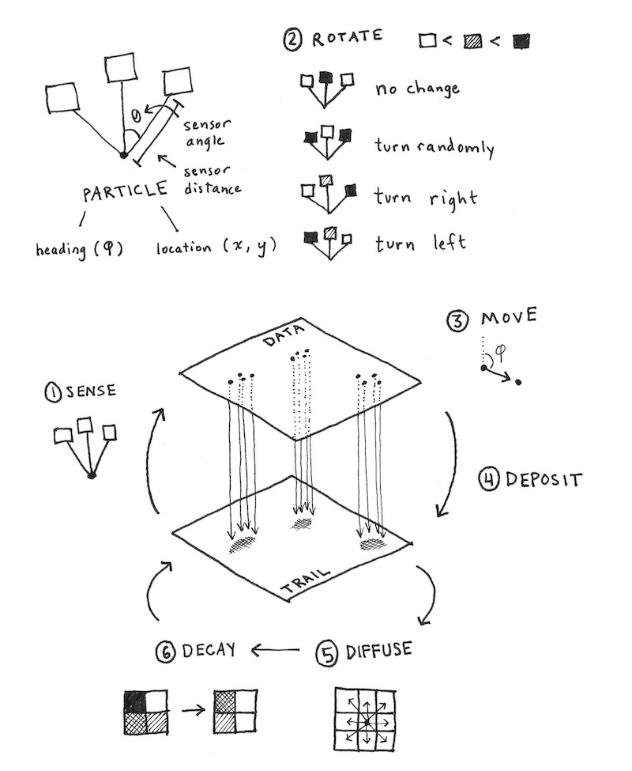
</div>

Beyond this basic model both blog posts take different stylistic tangents like adding random jitter, infection trails, geometric initialisation, etc. The results they show are _absolutely_ beautiful and you should read those blogs if this sounds interesting. I largely follow Antonio's basic design and forego the more involved aesthetic choices because the main focus is on the performance analysis of the algorithm (at least that is what i set off with). 

This is (largely) the PyTorch implementation, omitting helper functions for rendering etc.


```py
class PhysarumSim:
    def __init__(
        self, H, W, n_agents=100, step_size=1.0, sensor_dist=5,
        sensor_angle_spread=math.pi / 4, diffuse_kernel_size=3,
        diffuse_strength=0.2, decay_rate=0.01, device='cuda',
    ):
        self.device = device
        self.H = H
        self.W = W

        # pheromone field init with 0s
        self.field = torch.zeros((1, 1, H, W), device=device)

        # agents: positions (y, x), and headings (angle)
        self.n_agents = n_agents
        # initial positions random
        ys = torch.randint(0, H, (n_agents,), device=device).float()
        xs = torch.randint(0, W, (n_agents,), device=device).float()
        # headings uniform
        angles = 2 * math.pi * torch.rand(n_agents, device=device)
        # agent field init with random positions
        self.agent_pos = torch.stack([ys, xs], dim=1)  # shape [n_agents, 2]
        self.agent_angle = angles

        # sensor properties
        self.sensor_dist = sensor_dist
        self.sensor_spread = sensor_angle_spread
        self.step_size = step_size

        # diffusion / decay
        self.diffuse_kernel = torch.ones((1, 1, diffuse_kernel_size, diffuse_kernel_size), device=device)
        self.diffuse_kernel = self.diffuse_kernel / self.diffuse_kernel.sum()
        self.diffuse_strength = diffuse_strength
        self.decay_rate = decay_rate


    def sense(self, pos, angle):
        """
        Sample the field ahead of agent in several directions.
        Returns a measurement to steer the agent.
        """
        # compute offsets: straight, left, right
        offsets = torch.stack([
            torch.stack([torch.cos(angle), torch.sin(angle)], dim=1),
            torch.stack([torch.cos(angle + self.sensor_spread), torch.sin(angle + self.sensor_spread)], dim=1),
            torch.stack([torch.cos(angle - self.sensor_spread), torch.sin(angle - self.sensor_spread)], dim=1),
        ], dim=1)  # shape [n_agents, 3, 2]

        # sample field at positions pos + offsets * sensor_dist
        sample_points = pos.unsqueeze(1) + offsets * self.sensor_dist  # [n_agents, 3, 2]
        # clamp or wrap
        sample_points = sample_points % torch.tensor([self.H, self.W], device=self.device)

        # interpolate field at those sample points
        # use bilinear interpolation via grid_sample
        # need to map to normalized coords [-1,1]
        grid_y = (sample_points[...,0] / (self.H-1)) * 2 - 1
        grid_x = (sample_points[...,1] / (self.W-1)) * 2 - 1
        grid = torch.stack([grid_x, grid_y], dim=-1)  # shape [n_agents,3,2]

        fld = self.field  # 1,1,H,W
        # need grid sample with shape [batch, H', W', 2] so reshape
        sampled = F.grid_sample(fld.repeat(3,1,1,1), grid.view(3, self.n_agents, 1, 2), align_corners=True)
        sampled = sampled.view(3, self.n_agents)  # 3 x n_agents
        return sampled
```

Adding a couple more methods and some GIF saving bells and whistles allows us to actually visualise the output.

### Pretty Colors

Ok, let's take this for a spin. This is what the evolution of 200 agents looks like over 500 steps:

<div align="center">
<video src="./assets/physarum_test.mp4" autoplay loop muted playsinline style="max-width:100%;height:auto;">
    <!-- fallback -->
    
</video>
</div>

Messing around enough with the palletes and the parameter values:


<div align="center">
<video src="./assets/output_grid.mp4" autoplay loop muted playsinline style="max-width:50%;height:auto;">
</video>
</div>
<p style="text-align:center;font-size:0.95rem;color:var(--muted-color);margin-top:8px;">So pretty wow</p>


### Tanget 1 
Right now we initialise with a blank pheromone grid and randomised agent positions, but there can be more interesting initialisations. For one, what if we could get the grid to look like an image we care about. This also makes for a cool encryption technique - if the receiver knows the parameter values used for the simulation then all steps can be deterministically traced back to reveal the original image. An easy way to do this is to take an image, convert it to greyscale and use these values (scaled appropriately) as the init for the pheromone field:

```py
img = Image.open(image_path).convert('L')
img = img.resize((self.W, self.H), Image.Resampling.LANCZOS)
img_array = np.array(img) / 255.0

field_strength = 3.0
self.field[0, 0] = torch.tensor(img_array, device=self.device) * field_strength

ys = torch.randint(0, self.H, (n_agents,), device=self.device).float()
xs = torch.randint(0, self.W, (n_agents,), device=self.device).float()
```

Here is the office kitty (getting eaten by mold :/)
<div align="center">
<video src="./assets/cat_combo_side_by_side.mp4" autoplay loop muted playsinline style="max-width:75%;height:auto;">
</video>
</div>

And here are my clearly unimpressed "friends" >:(
<div class="image-row image-row--narrow">
    <figure>
        
    </figure>
    <figure>
        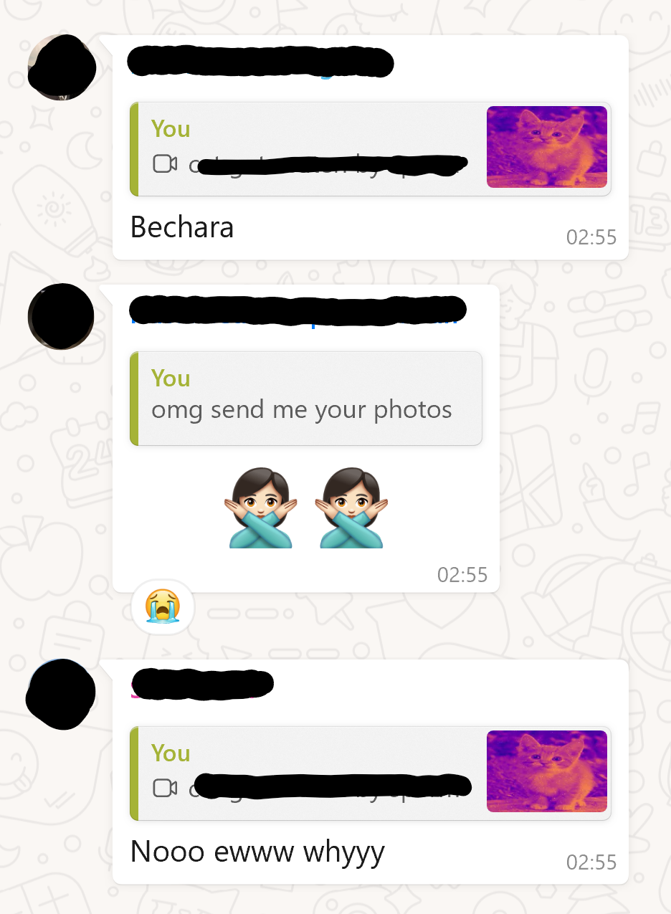
    </figure>
</div>

### Tangent 2
A small obsession of mine some time ago were (pseduo-)random algorithms for things like terrain generation. The Physarum simulation is a good candidate for terrain/cave generation because all you need to do is discretize the outputs and you get crevices that grow and shrink in a pretty way. An exceedingly easy way to do this discretization is to simply use a discrete `matplotlib` palette. One of these:

<div align="center">
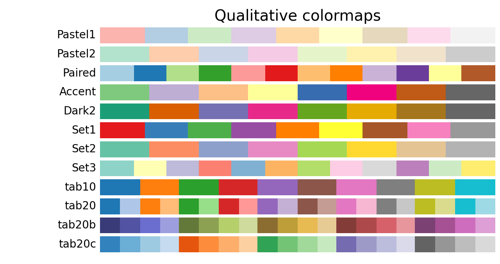
</div>

Here are some examples:
<div align="center">
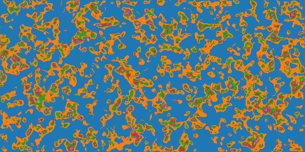
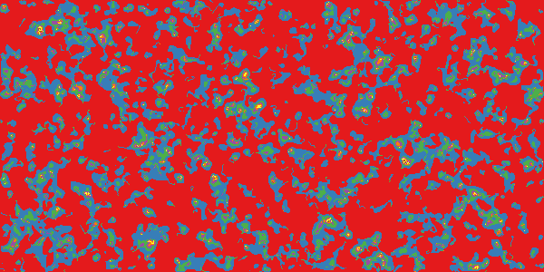
</div>

A lot of these techniques use algorithms are of course not random because of deterministism (the same input with the same seed will give you the same output) but serve as good proxies because they _look_ random enough. One measure of randomness I want to borrow from boolean function analysis is _average sensitivity_ which I came across in [this](https://aclanthology.org/2024.acl-long.800/) very nice paper. The idea was that if we are able to show that the Physarum growth simulation is sensitive to initialisation then that would be a good case for it being a "pseudo-random" algorithms (I understand that even pseudo-random is the incorrect word because of characteristic patterns, but idk what a better word would be. Please take it to mean whatever makes Perlin noise a good terrain generator ¯\_(ツ)_/¯). 
 I am sure there are better measures, but I wanted to do this crackpot-ery to see if it goes somewhere. So we start with sensititivty for boolean functions.

a Boolean function $f : \{0,1\}^n \to \{0,1\}$. For an input $x \in \{0,1\}^n$, the (local) sensitivity counts the number of single-bit flips that change the outcome,
$$
s(f, x) = \left|\left\{ i \in [n] : f(x) \neq f\bigl(x \oplus e_i\bigr) \right\}\right|,
$$
where $x \oplus e_i$ flips the $i$-th coordinate. Averaging over the cube gives the global score,
$$
\operatorname{as}(f) = \mathbb{E}_{x \sim \{0,1\}^n}[s(f,x)] = \frac{1}{2^n} \sum_{x \in \{0,1\}^n} s(f,x).
$$

But our model is not a boolean function (i think it can be expressed as a boolean function if we come up with an appropriate decimal $\to$ binary encoding for the input and outputs, but i wasn't sure how to do this while satisfying all the constraints required. I think the naive encoding doesn't work because 1 bit flip should represent semantically similar degrees of change regardless of position, which is not the case for the naive conversion). But then I realised that _sensitivty_ is just a measure in boolean functions of what would otherwise be the _derivitive_ with respect to the input... so much mental gymnastics. So, now let's look at the derivitives (parts of the following section was written with the help of ChatGPT-5 and so inadvertent errors might be present)

So for a continuous function, let $f : X \to Y$ with $X \subseteq \mathbb{R}^n$ and equip $Y$ with a norm-induced metric $d(a,b)=\lVert a-b\rVert$. The directional sensitivity along coordinate $i$ becomes the directional derivative measured in that norm,
$$
s_i(f, x) = \lim_{\epsilon \to 0} \frac{\lVert f(x) - f(x + \epsilon e_i) \rVert}{\epsilon}.
$$
Summing over coordinates recovers the local score,
$$
s(f, x) = \sum_{i=1}^n s_i(f, x),
$$
and integrating against any input distribution $\mu$ (random agent initialisations, diffusion strength, etc.) yields the average sensitivity
$$
\operatorname{as}_{\mu}(f) = \mathbb{E}_{x \sim \mu}[s(f,x)].
$$

When $f$ is differentiable and $Y \subseteq \mathbb{R}^m$, the limit above is just the column-wise norm of the Jacobian:
$$
J_f(x) = \left[\frac{\partial f_i}{\partial x_j}(x)\right]_{i=1..m,\; j=1..n}, \qquad s_i(f,x) = \left\|\frac{\partial f}{\partial x_i}(x)\right\|.
$$
In Euclidean space this makes $s(f,x)$ the sum of Euclidean norms of the Jacobian columns (the operator 1-norm induced by $\lVert\cdot\rVert_2$). If you care about a different notion of "large change," just swap in the matrix norm that matches your metric.

For the Physarum update rule $x_{t+1} = F(x_t, \theta)$, sensitivities compound over time because each step multiplies the previous perturbation by a Jacobian:
$$
\Delta x_t \approx \left(\prod_{k=0}^{t-1} J_F(x_k)\right) \Delta x_0.
$$
The rate at which these products blow up (or shrink) is governed by the [Lyapunov exponent](https://en.wikipedia.org/wiki/Lyapunov_exponent) of $F$, which quantifies how much two trajectories diverge given an initial seperation. The largest exponent
$$
\lambda_{\max} = \lim_{t \to \infty} \frac{1}{t} \log \frac{\lVert\Delta x_t\rVert}{\lVert\Delta x_0\rVert}
$$
is the formal version of "do tiny changes in initialisation change the output by a lot" A positive $\lambda_{\max}$ mean "yes".

#### A linear toy model

I will now cheat and deal with an incredibly simple model of the algorithm, where each state is a 2-tuple and all changes to states are linear functions with only minimal parameters as you will see. Collapse Physarum’s state to pheromone magnitude $p_t$ and aggregate agent activity $y_t$. Stack them into $x_t = (p_t, y_t)^\top \in \mathbb{R}^2$ and let the update be linear,
$$
x_{t+1} = F(x_t; \theta) = Ax_t,\qquad
A = \begin{pmatrix} 1 - \beta & \alpha \\ \gamma & 1 - \kappa \end{pmatrix},
$$
with parameters:

$\alpha > 0$ — pheromone deposition by agents,

$\beta \in (0,1)$ — pheromone decay,

$\gamma > 0$ — agent response to pheromone,

$\kappa \in (0,1)$ — agent damping.

Perturb an initial state by $\delta x_0$ and it evolves as $\delta x_t = A^t \delta x_0$. If $A$ diagonalises as $A = V\Lambda V^{-1}$ with eigenpairs $(\lambda_j, v_j)$, the perturbation decomposes into eigen-directions,
$$
\delta x_t = \sum_{j=1}^2 c_j \lambda_j^t v_j.
$$
The largest $|\lambda_j|$ wins, so the discrete-time Lyapunov exponent is simply
$$
\lambda_{\max}^{\text{Lyap}} = \log \rho(A), \qquad \rho(A) = \max(|\lambda_1|,|\lambda_2|).
$$
Eigenvalues drop straight out of the quadratic formula,
$$
\lambda_{\pm} = \frac{2 - \beta - \kappa \pm \sqrt{(\beta - \kappa)^2 + 4\alpha\gamma}}{2},
$$
so exponential growth shows up exactly when $\lambda_+ > 1$. Rearranging the inequality gives a clean condition,
$$
\rho(A) = \lambda_+ > 1 \;\Longleftrightarrow\; (\beta - \kappa)^2 + 4\alpha\gamma > (\beta + \kappa)^2 \;\Longleftrightarrow\; \alpha\gamma > \beta\kappa.
$$

Interpretation: the positive feedback loop $\alpha\gamma$ (agents deposit pheromone, pheromone excites agents) has to overpower the damping product $\beta\kappa$ (pheromone decay times agent sluggishness). When that inequality holds we get $\lVert\delta x_t\rVert \approx \rho(A)^t \lVert\delta x_0\rVert$ with $\rho(A) > 1$, i.e. perturbations explode exponentially fast. Which is to say, that under certain conditions the function is exponentially sensitive to perturbations in the input, which is what we set out to prove. Yay! 

This section is a little rushed, and I was admittedly out of my depth in places so please lmk if you find any errors or if theres an easier way to show this without the gross simplifaction assumptions ive made, thanks <3

## Profiling

Let's finally look at the performance of our system. An obvious place to start would be to look at how long our simulation takes to run. Looking at the code, the simulation is linear in the number of steps, quadratic in grid size, and constant in number of agents. Let's test this by ablating across these params and log the simulation time.

<div class="profiling-grid">
    <div class="profiling-item">
        <h4>Number of Steps</h4>
        <div align="center">
            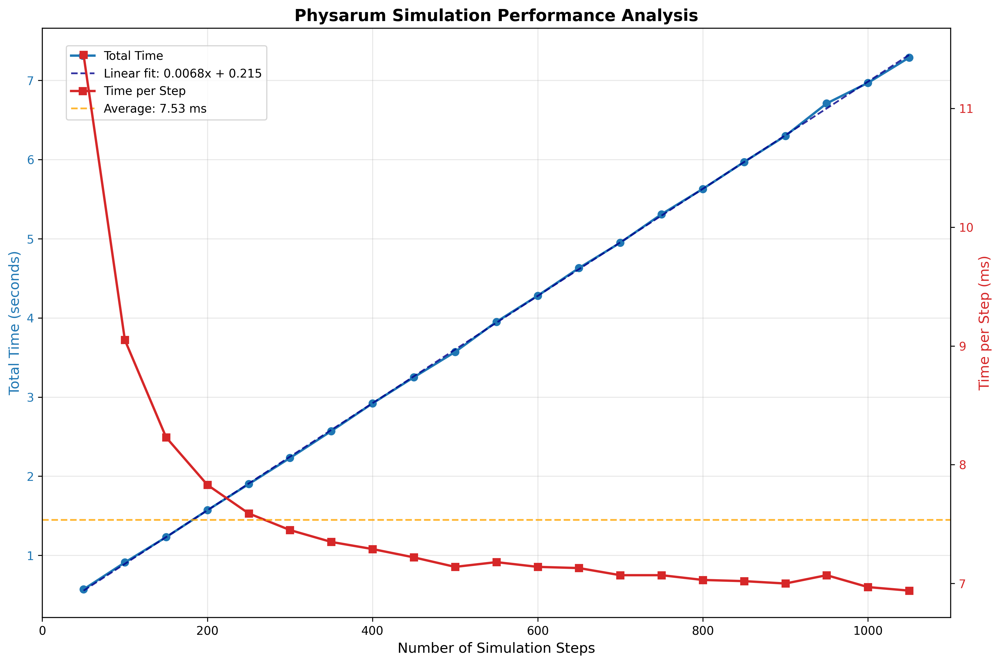
        </div>
    </div>
    <div class="profiling-item">
        <h4>Grid Size</h4>
        <div align="center">
            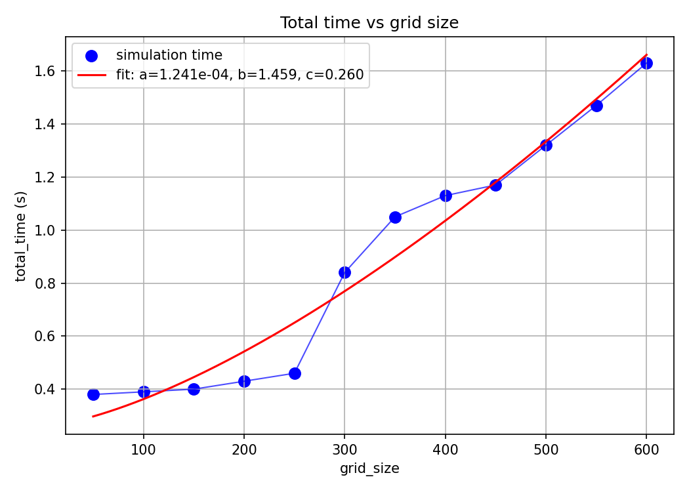
        </div>
    </div>
    <div class="profiling-item">
        <h4>Number of Agents</h4>
        <div align="center">
            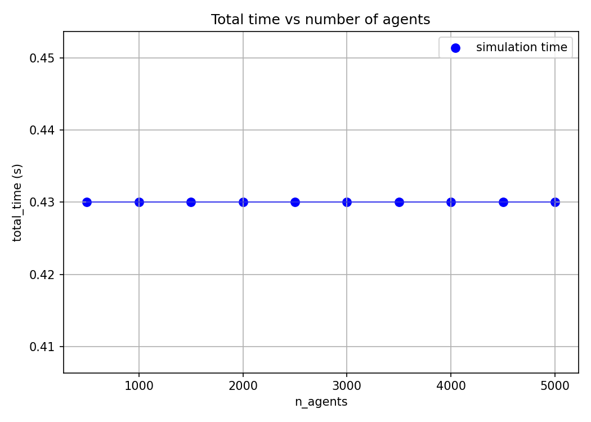
        </div>
    </div>
</div>

While these time logs are helpful to gauge the complexity of our program, they're not exactly useful. We already knew the program to be linear, quadratic and constant in these parameters before we saw the plots. It's unsure where to go from here to optimise our program.

Another time log that is more interesing to look at is the time taken at different _stages_ of the program by different _operations_. 

For example, due to hardware idiosynchrasies operations including bit arithmetic, rsqrt (reciprocal square root), FMA (Fused Multiply-Add) are faster and so if we are able to rewrite parts of our program to use these ops. then we get free perf. This is only an example of why operation level time-logging is useful, I will not be doing these optimisations in this blog.

Also, look at the time-scaling for the grid size: it is only _sorta_ quadratic (the fit line being $y=1.241e^{-4}x^{1.459}+0.260$) which is $O(x^{1.5})$ as opposed to the theoretical $O(x^2)$. 

A hypothesis explaining this imperfect fit might be that we do some initial setting up that accrues a constant overhead that messes our fit. But we can't validate/falsify this without looking at the individual operations.

### The PyTorch Profiler

Thankfully the nice people at PyTorch have saved us the trouble of wrapping all of our operations individually and manually with `time.time()` calls by instead wrapping the call to `step` method in `run` with the profiler object (you can also instead wrap `main` or any other superset of the triggered code containing `run` to get other overhead logs, but i found this approach to be cleaner).

The minimal modification is this:
```py
from torch.profiler import profile, record_function, ProfilerActivity
with profile(
    activities=[ProfilerActivity.CPU, ProfilerActivity.CUDA],
    record_shapes=True,
    profile_memory=True,
    with_stack=True,
    on_trace_ready=torch.profiler.tensorboard_trace_handler('./profiling')
) as prof:
    for i in range(steps):
        with record_function(f"simulation_step_{i}"):
            self.step()
        prof.step()
```

We can also annotate different sections within `step` to make trace easier to understand. I have sectioned the code like this:
```py
def step(self):
    with record_function("step_sensing"):
        samples = self.sense(self.agent_pos, self.agent_angle)
        straight, left, right = samples[0], samples[1], samples[2]
        best = torch.argmax(torch.stack([straight, left, right], dim=0), dim=0)

    with record_function("step_steering"):
        turn_angle = self.sensor_spread
        self.agent_angle = torch.where(best == 1, self.agent_angle + turn_angle,
                                torch.where(best == 2, self.agent_angle - turn_angle, self.agent_angle))

    with record_function("step_movement"):
        dy = torch.sin(self.agent_angle) * self.step_size
        dx = torch.cos(self.agent_angle) * self.step_size
        self.agent_pos = self.agent_pos + torch.stack([dy, dx], dim=1)
        self.agent_pos = self.agent_pos % torch.tensor([self.H, self.W], device=self.device)

    with record_function("step_deposition"):
        iy = self.agent_pos[:,0].long().clamp(0, self.H-1)
        ix = self.agent_pos[:,1].long().clamp(0, self.W-1)
        self.field[0,0, iy, ix] += 1.0

    with record_function("step_diffusion"):
        field_blur = F.conv2d(self.field, self.diffuse_kernel, padding=(self.diffuse_kernel.shape[2]//2), groups=1)
        self.field = (1 - self.diffuse_strength) * self.field + self.diffuse_strength * field_blur
        self.field = self.field * (1 - self.decay_rate)
```

and `sense` like this:
```py
def sense(self, pos, angle):
        with record_function("sense_compute_offsets"):
            offsets = torch.stack([
                torch.stack([torch.cos(angle), torch.sin(angle)], dim=1),
                torch.stack([torch.cos(angle + self.sensor_spread), torch.sin(angle + self.sensor_spread)], dim=1),
                torch.stack([torch.cos(angle - self.sensor_spread), torch.sin(angle - self.sensor_spread)], dim=1),
            ], dim=1)

        with record_function("sense_sample_points"):
            sample_points = pos.unsqueeze(1) + offsets * self.sensor_dist
            sample_points = sample_points % torch.tensor([self.H, self.W], device=self.device)

        with record_function("sense_grid_sample"):
            grid_y = (sample_points[...,0] / (self.H-1)) * 2 - 1
            grid_x = (sample_points[...,1] / (self.W-1)) * 2 - 1
            grid = torch.stack([grid_x, grid_y], dim=-1)

            fld = self.field
            sampled = F.grid_sample(fld.repeat(3,1,1,1), grid.view(3, self.n_agents, 1, 2), align_corners=True)
            sampled = sampled.view(3, self.n_agents)
        return sampled
```

#### Scary Colors
<div class="note-callout">
<strong>Note.</strong> The written medium lends itself to an explanation of visualisation softwares much lesser than videos, and so while I have tried to explain what you should be seeing with descriptions and screenshots watching a video tutorial might be both faster and easier to understand.
</div>

Running this outputs a `.json` file that can be uploaded to a visualiser (I use [perfetto](https://ui.perfetto.dev/) in this example). You can use the WASD keys to move around.
<div align="center">
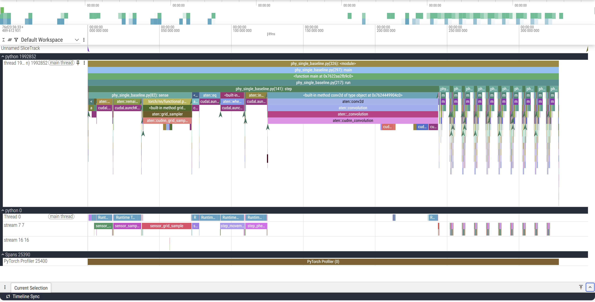
</div>

On the left the *python XXXX* label corresponds to the launched process with *XXXX* PID, below that are the threads that this process launches. In our case we launch a single thread. So here, *python 1992852* is the **CPU** process we launch. But because we run this on a cuda device, the actual operations don't happen on the CPU which just enqueues and launches the GPU processes. *python 0* corresponds to the GPU process (0 being a stand-in PID), and the *streams* correspond to the GPU execution contexts (tl;dr threads:CPU::streams:GPU). 

 The Y axis represnts our call trace with time on the X axis. You can see in the CPU track that `main` is on top which calls `run` below it which in turn calls `step` (and `render` which is a helper function to plot and save the frames to a GIF) which calls `sense` and other operations. For example, zooming in:

<div align="center">
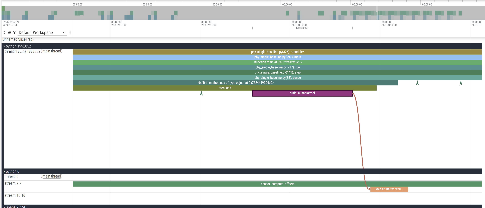
</div>

The final `cudaLaunchKernel` is a CUDA API which _enqueues_ the operation in the CUDA stream (and hence the call is asynchronous because it returns after pushing it in the CUDA stream without waiting for it to actually execute) which you can trace with the brown line connecting the CPU and GPU stream. To better contextualise, this is where this zoomed in section occurs:

<div align="center">
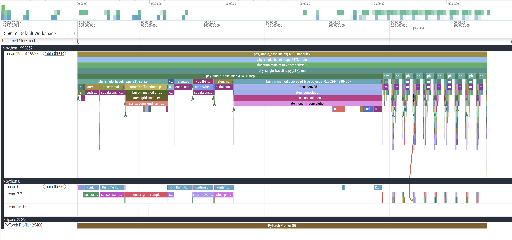
</div>

##### GPU Processes
Our annotations from before now make our lives easier. Within the GPU stream, we can see these 9 collections of operations happening in consistent order and (mostly) consistent duration. This particular example only profiles 10 steps of the simulation, so the 9 blocks make sense (we'll come back to the 10th). 
<div align="center">
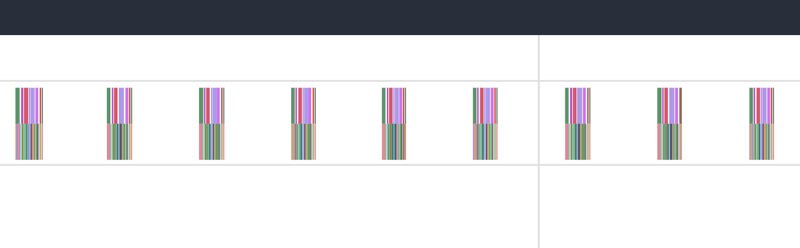
</div>

Zooming in to one of them:
<div align="center">
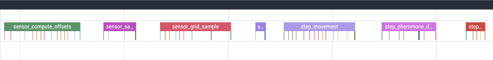
</div>

These are the annotations we used to section our code. Checking the code, the first operation we call in `sensor_compute_offsets` is calculate the `cos` which is what we see in the viz as well:
<div align="center">
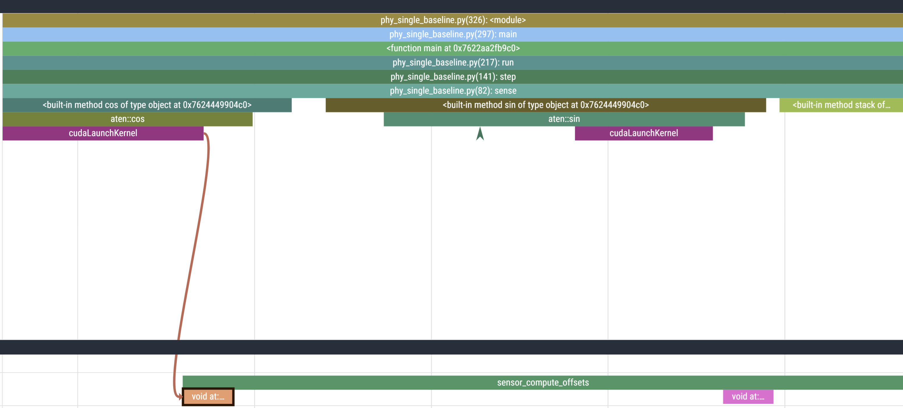
</div>

### Initialization Overhead
So far we have glossed over a glaring detail: the starting section of the trace is much longer than the rest. The first call to `step` takes ~244ms while the next takes only ~2.
<div class="image-row">
    <figure>
        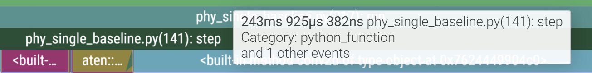
    </figure>
    <figure>
        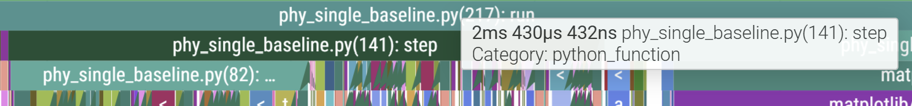
    </figure>
</div>

This is also why, out of the 10 profiled steps, we only see 9 similar blocks in a row in the GPU stream. This is because PyTorch _lazily_ loads kernels and libraries the first time you call them and then caches it (the PyTorch profiler does not record C++/CUDA work outside PyTorch operators, so while setting up cuBLAS/cuDNN contexts it doesn't explicitly report those actions. Notice the first call to `aten::conv2d` takes long due to the call to `aten::cudnn_convolution`). During initialisation cuda also needs to allocate memory buffers to hold data, load modules, optionally JIT-compile routines (more relevant for deep learning programs with gradient graphs), etc.

<div align="center">
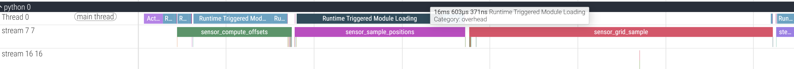
</div>

This validates our hypothesis of improper fits and also gives us a good idea of how long each section of the programs takes thanks to our annotations which can inform any optimisation we choose to spend our efforts on.

## Triton

Triton is a python-like Domain-Specific Language (other examples of DSLs are SQL, Verilog, etc. and differ from _general_ programing languages like C in their domain specific design) to write CUDA kernels without having to write CUDA code. It sits between PyTorch and CUDA in how much control it exposes to the programer. A kernel is just a parallelizable function that runs on a GPU. This TL;DR'd explanation of Triton does not do it justice, and you should look some of these things up, including [this talk](https://youtu.be/G951lCm_qnk?si=S3aF3bpHX9641RRJ) by it's creator.

Whenever you see `@triton.jit` above a function, you're looking at Triton's just-in-time compiler hook. The first time that Python function is called, Triton traces its body, specialises it for the concrete launch parameters (`BLOCK_SIZE`, tensor strides, dtypes), and emits PTX that the GPU can execute. Subsequent calls skip Python entirely—the compiled kernel is cached and launched directly—so all of your Python control flow stays at the edges while the hot path runs at device speed.

### A warm-up kernel: row-wise softmax

To flex our muscles, here’s a kernel for the row-wise softmax. PyTorch already gives you `torch.nn.functional.softmax`, but when your matrices are skinny (think transformer attention scores with 64–128 columns) you end up launching several generic kernels—max, subtract, exp, sum, divide—plus the intermediate tensors they create. Triton lets us fuse that whole pipeline into one pass.

```py
import torch
import triton
import triton.language as tl


@triton.jit
def row_softmax_kernel(
    input_ptr, output_ptr,
    stride_in, stride_out,
    n_cols,
    BLOCK_SIZE: tl.constexpr,
):
    row_id = tl.program_id(axis=0)
    row_in_ptr = input_ptr + row_id * stride_in
    row_out_ptr = output_ptr + row_id * stride_out

    offs = tl.arange(0, BLOCK_SIZE)
    mask = offs < n_cols
    row_vals = tl.load(row_in_ptr + offs, mask=mask, other=-float("inf"))

    row_max = tl.max(row_vals, axis=0)
    shifted = row_vals - row_max
    numerators = tl.exp(shifted)
    denom = tl.sum(numerators, axis=0)
    softmax_vals = numerators / denom

    tl.store(row_out_ptr + offs, softmax_vals, mask=mask)


def triton_row_softmax(x: torch.Tensor) -> torch.Tensor:
    assert x.is_cuda and x.ndim == 2
    n_rows, n_cols = x.shape
    out = torch.empty_like(x)
    stride_in = x.stride(0)
    stride_out = out.stride(0)
    block = triton.next_power_of_2(n_cols)
    block = min(block, 128)
    grid = (n_rows,)
    row_softmax_kernel[grid](
        x, out,
        stride_in, stride_out,
        n_cols,
        BLOCK_SIZE=block,
    )
    return out
```

Why is this faster than just calling `torch.softmax`? Triton lets us tailor the launch geometry to our data, keep the intermediate values in registers, and avoid writing the exponentiated tensor back to global memory before the reduction. PyTorch’s implementation is necessarily defensive—it supports arbitrary axis, dtype, and shape combinations—so it pays for extra bounds checks, temporary buffers, and multiple kernel launches. The point being that custom Triton implementations allow you to leverage the design gurantees your specific use case provides. A second order advantage are the huuuuge memory savings that are possible with triton because now you're not storing temporary tensors, and for model training this means you can fit in larger batch sizes which in turn speeds up the training as well.

### Triton 101

Triton wants you to think in rectangular tiles of work, not individual scalars, which is to say we'll come up with a way to index into a section of our data (the tiles of work) and then define a logic over them which Triton then compiles into eficient PTX. Each kernel launch is parameterised by `program_id`s that index those tiles, and every value you read or write has to flow through a pointer you compute by hand. A few design constraints to keep in your head while writing kernels:

- **Static launch shape:** Block sizes (`BLOCK_SIZE` below) are compile-time constants. Pick them so the kernel has enough parallelism to saturate the GPU while keeping registers in check.
- **Explicit memory math:** You own the pointer arithmetic. Triton hands you raw pointers; you stride through flattened tensors yourself, so misaligned access turns straight into wasted bandwidth.
- **Vector-friendly instructions:** The DSL mirrors CUDA’s fast math (`tl.sin`, `tl.cos`, `tl.where`), predicate masks, and modular arithmetic. If you can write the update rule in terms of vector ops, Triton can fuse it into a single warp-friendly kernel.

With those guardrails in place, the Physarum simulation splits cleanly into three phases:

1. **Sense & steer:** Every agent samples three points in front of it, picks a direction, and updates its heading.
2. **Deposit:** Wherever an agent lands, it leaves a pheromone breadcrumb so the trail remains visible.
3. **Diffuse & decay:** The field blurs and fades so older trails dissipate instead of blowing out the colour map.

The first two phases are bespoke vector math, and hence good fits for kernels.

#### Kernel 1 — fused sensing + steering

```py
import triton
import triton.language as tl


@triton.jit
def agent_sense_and_update_kernel(
    agent_pos_ptr, agent_angle_ptr,
    field_ptr,
    new_pos_ptr, new_angle_ptr,
    H, W,
    sensor_dist: tl.constexpr,
    sensor_spread: tl.constexpr,
    step_size: tl.constexpr,
    n_agents,
    BLOCK_SIZE: tl.constexpr,
):
    pid = tl.program_id(axis=0)
    agent_indices = pid * BLOCK_SIZE + tl.arange(0, BLOCK_SIZE)
    mask = agent_indices < n_agents

    pos_y = tl.load(agent_pos_ptr + agent_indices * 2 + 0, mask=mask, other=0.0)
    pos_x = tl.load(agent_pos_ptr + agent_indices * 2 + 1, mask=mask, other=0.0)
    angle = tl.load(agent_angle_ptr + agent_indices, mask=mask, other=0.0)

    sin_angle = tl.sin(angle)
    cos_angle = tl.cos(angle)
    sin_left = tl.sin(angle + sensor_spread)
    cos_left = tl.cos(angle + sensor_spread)
    sin_right = tl.sin(angle - sensor_spread)
    cos_right = tl.cos(angle - sensor_spread)

    straight_y = (pos_y + sensor_dist * sin_angle) % H
    straight_x = (pos_x + sensor_dist * cos_angle) % W
    left_y = (pos_y + sensor_dist * sin_left) % H
    left_x = (pos_x + sensor_dist * cos_left) % W
    right_y = (pos_y + sensor_dist * sin_right) % H
    right_x = (pos_x + sensor_dist * cos_right) % W

    iy_s = tl.minimum(tl.maximum(tl.cast(straight_y, tl.int32), 0), H - 1)
    ix_s = tl.minimum(tl.maximum(tl.cast(straight_x, tl.int32), 0), W - 1)
    iy_l = tl.minimum(tl.maximum(tl.cast(left_y, tl.int32), 0), H - 1)
    ix_l = tl.minimum(tl.maximum(tl.cast(left_x, tl.int32), 0), W - 1)
    iy_r = tl.minimum(tl.maximum(tl.cast(right_y, tl.int32), 0), H - 1)
    ix_r = tl.minimum(tl.maximum(tl.cast(right_x, tl.int32), 0), W - 1)

    straight_val = tl.load(field_ptr + iy_s * W + ix_s, mask=mask, other=0.0)
    left_val = tl.load(field_ptr + iy_l * W + ix_l, mask=mask, other=0.0)
    right_val = tl.load(field_ptr + iy_r * W + ix_r, mask=mask, other=0.0)

    turn_left = (left_val > straight_val) & (left_val > right_val)
    turn_right = (right_val > straight_val) & (right_val > left_val)
    new_angle = tl.where(turn_left, angle + sensor_spread,
                 tl.where(turn_right, angle - sensor_spread, angle))

    new_sin = tl.sin(new_angle)
    new_cos = tl.cos(new_angle)
    new_pos_y = pos_y + step_size * new_sin
    new_pos_x = pos_x + step_size * new_cos
    new_pos_y = new_pos_y - tl.floor(new_pos_y / H) * H
    new_pos_x = new_pos_x - tl.floor(new_pos_x / W) * W

    tl.store(new_pos_ptr + agent_indices * 2 + 0, new_pos_y, mask=mask)
    tl.store(new_pos_ptr + agent_indices * 2 + 1, new_pos_x, mask=mask)
    tl.store(new_angle_ptr + agent_indices, new_angle, mask=mask)
```

Every instruction above reuses data while it’s in registers: positions and headings are loaded once, the three sensor rays are evaluated in parallel, and the winning angle immediately feeds the position update. Keeping all of that inside one kernel means we avoid round-tripping intermediate tensors through global memory, which is why this runs faster than chaining separate PyTorch ops (fewer kernel launches, fewer memory synchronisations, and better cache locality for the field samples).

#### Kernel 2 — atomic pheromone deposition

```py
@triton.jit
def pheromone_deposit_kernel(
    agent_pos_ptr, field_ptr,
    deposit_amount: tl.constexpr,
    H, W, n_agents,
    BLOCK_SIZE: tl.constexpr,
):
    pid = tl.program_id(axis=0)
    agent_indices = pid * BLOCK_SIZE + tl.arange(0, BLOCK_SIZE)
    mask = agent_indices < n_agents

    pos_y = tl.load(agent_pos_ptr + agent_indices * 2 + 0, mask=mask, other=0.0)
    pos_x = tl.load(agent_pos_ptr + agent_indices * 2 + 1, mask=mask, other=0.0)
    iy = tl.minimum(tl.maximum(tl.cast(pos_y, tl.int32), 0), H - 1)
    ix = tl.minimum(tl.maximum(tl.cast(pos_x, tl.int32), 0), W - 1)

    field_idx = iy * W + ix
    tl.atomic_add(field_ptr + field_idx, tl.where(mask, deposit_amount, 0.0), mask=mask)
```

By batching agents into `BLOCK_SIZE` threads and using `tl.atomic_add`, we push thousands of deposits into the pheromone field in one launch without writing the same cell multiple times from Python. The atomics guarantee correctness when two agents collide, and we only touch the flattened field once, so memory bandwidth becomes the only bottleneck.

###  PyTorch vs Triton

It helps to zoom out and line up the old PyTorch pipeline with the new kernels:

- **Original PyTorch flow:** Each micro-step (sense → compare → turn → move → scatter add) was a separate tensor op. PyTorch launched a new CUDA kernel for every line inside `step`, materialised temporary tensors like the stacked sensor samples, and shuttled agent positions back to global memory between phases.
- **Triton rewrite:** We fuse the entire agent update into one launch, keep intermediate values in registers, and write the final positions/angles exactly once. The deposit phase becomes a tight atomic add loop with zero Python branching. Diffusion stays `conv2d`, so the only difference there is that the field entering it is already in cache-friendly layout from the previous kernels.

But you don't trust me, huh? Let's see the trace for the Triton compiled simulation. Here are our familiar islands, each corresponding to one simulation step:
<div align="center">
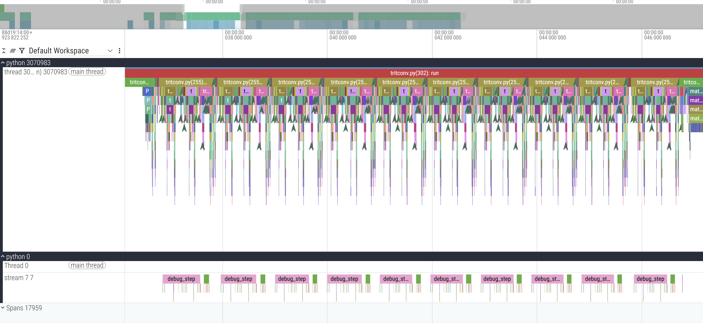
</div>

I don't remember why I annotated with the labels I did, please forgive in the spirit of "research quality prototyping". Amyways, zooming in:
<div align="center">
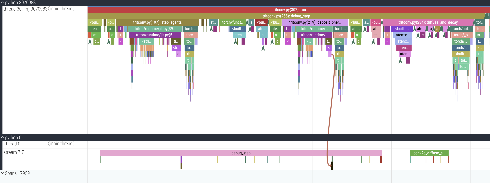
</div>

1 simulation step runs in only 17 cudaLaunchKernels, as opposed to 55 in the previous trace. Don't doubt me again >:(

Let's see how much time Triton saves us. We'll write a simple `benchmarking` function, which abstractly looks like this:

```py
start_time = time.time()
simulation.run()
torch.cuda.synchronize()
simulation_time = time.time()-start_time
```

The point being that we need to call `torch.cuda.synchronize()` to log the actual time of _completion_ since we saw that the CPU side operations are asynchronous and return as soon as they enqueue in the CUDA stream without waiting for completion. 

<div align="center">
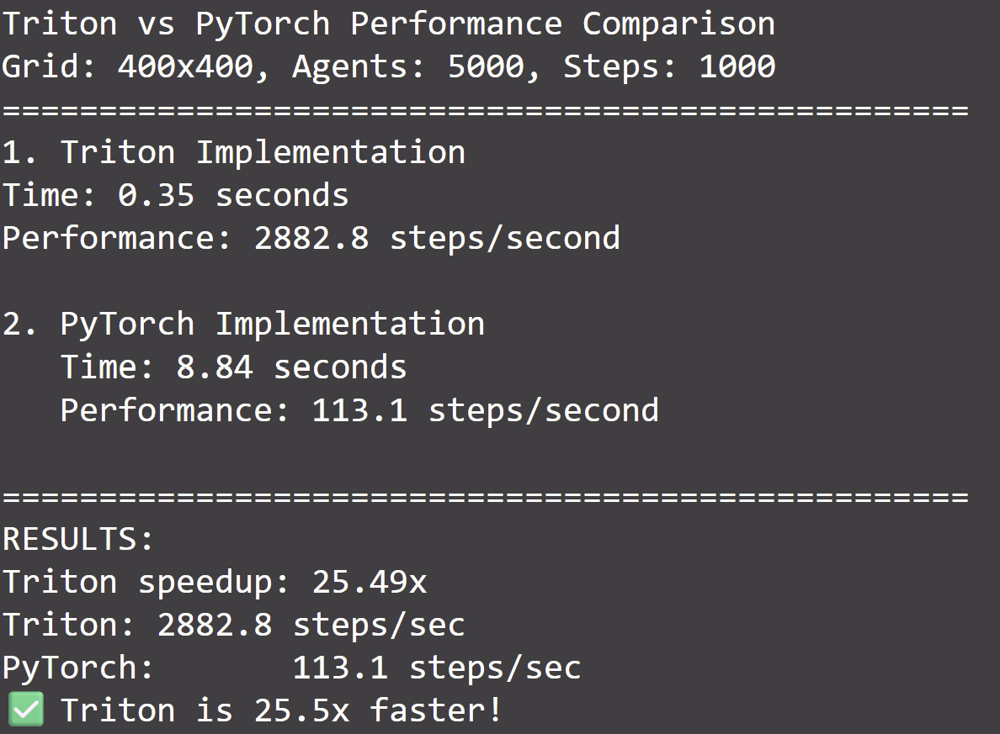
</div>

Here are 4 of the generated samples in 4 color palettes because I couldn't choose which looked better
<div align="center">
<video src="./assets/phy_grid_2x2.mp4" autoplay loop muted playsinline style="max-width:75%;height:auto;">
</video>
</div>


Here is a dump of some scrap frames made into a collage:

<div align="center">
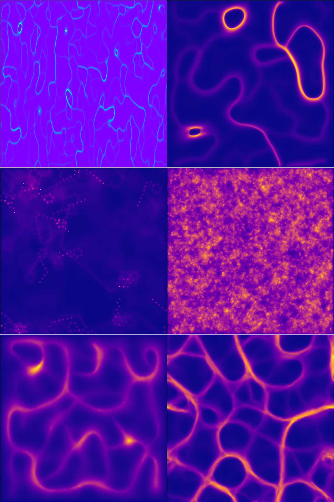
</div>


