# Balls and More: Experiments With Ray Tracers
## PART 1


## Yapping and background
I have worked a little bit with Neural Radiance Fields in the past before, especially on the neural part of it while treating the rendering part as a black box. But I have had a lot of free time lately so I went through Peter Shirley's amazing blog on ray tracing https://raytracing.github.io/ and built a primitve ray tracer of my own. So far the blog contains only the very basics of the tracer, and I plan to keep updating it and also implement some cool ideas I have that are possible with the current skeleton (but which I am too lazy for right now. I have been working on this blog for 5 days now which is 4 more than i expected to). You should go through the original weekend series, it's extremely well written and concise. I mostly follow it but eventually change a few things and take a different turn. Happy to hear any ideas you have about cool things to build with it. As you will see later, I used the tracer to render surfaces other than spheres (which shirley limits his first part of the series to), and this took the most time, so if you are able to parametrise ray collisions with any cool surfaces, i'd be happy to add it to the blog (with due credit). Just send the math also if you want, the coding part is trivial, but i really am too old to solve cubic equations now :') 

~~All~~ Most the code (albeit a little disorganised) can be found here: https://github.com/ut21/Ray-Tracing-Basics/tree/main
I'll eventually clean up the repo, but for now I have provided all the code within the blog if you need it.

Have a good read :D

## Viewing the image and the PPM format

The first thing I did was to set up how I was going to view the images. To do this, I wrote values to a file in the PPM (Portable Pixmap) format. To have a taster write the following in a .ppm file.

```
P3
3 2
255
255 0 0 0 255 0 0 0 255
255 255 0 255 255 255 0 0 0
```

To view a PPM file I am using an extension within VS Code. The output looks like:
(image)

Now lets write a PPM file using code:
```cpp
#include <iostream>
#include <fstream>
using namespace std;

int main(){
    int nx = 200; //image width
    int ny = 100; //image height
    ofstream myfile;
    myfile.open ("image.ppm");
    myfile << "P3\n" << nx << " " << ny << "\n255\n";
    for(int j = ny-1; j>=0; j--){
        for(int i=0; i<nx; i++){
            clog << "\rScanlines remaining: " << (ny - j) << ' ' << flush; //used as a progres bar
            double r = (double)i/(nx-1); //red channel
            double g = (double)j/(ny-1); //green channel
            double b = 0.0; //blue channel
            int ir = int(255.999 * r);
            int ig = int(255.999 * g);
            int ib = int(255.999 * b);
            myfile << ir << " " << ig << " " << ib << "\n";
        }
    }
    clog << "\rDone.                 \n";
    myfile.close();
}
```

running the following command in the directory containig your file:
```bash
g++ <filename>.cpp \
&& ./a.out \
&& code image.ppm
```

Outputs  the following image:

<p style="text-align:center">
    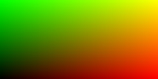
</p>


Instead of writing to a file, you could also write the stdout using cout and then `>` to redirect the text to a file of your choosing. In this case, your code uses standard I/O and is compiled like this:

```bash
g++ <filename>.cpp \
&& ./a.out > image.ppm\
&& code image.ppm
```

But I eventually moved away from this approach because I later needed to log '$t$' values for debugging (don't worry about $t$ for now) and found it more convient to print it to stdout and then redirect  while printing the pixel values directly to a file.

The code lines:
```cpp
double r = (double)i/(nx-1); //red channel
double g = (double)j/(ny-1); //green channel
double b = 0.0; //blue channel
```
define the gradient logic and you can try playing around with this. For example:

```cpp
int center_x = nx/2;
int center_y = ny/2;
double max_dist = sqrt(nx/2 * nx/2 + ny/2 * ny/2);
for(int j = ny-1; j>=0; j--){
    for(int i=0; i<nx; i++){
        int dist = sqrt((i-center_x)*(i-center_x) + (j-center_y)*(j-center_y));
        double r = dist/max_dist; //red channel
        double g = 1.0-(dist/max_dist); //green channel
        double b = 1.0; //blue channel
        ...
    }
}
```
outputs this circular gradient:

<p style="text-align:center">
    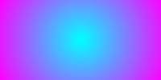
</p>


## The vec3 Class

I created a class called vec3 the objects of which stores three float values corresponding to rgb. This is my `vec3.h` file:

```cpp
#ifndef VEC3H
#define VEC3H

#include <math.h>
#include <stdlib.h>
#include <iostream>

class vec3 {
public:
    vec3() {}
    vec3(float e0, float e1, float e2) { e[0] = e0; e[1] = e1; e[2] = e2; }
    inline float x() const { return e[0]; }
    inline float y() const { return e[1]; }
    inline float z() const { return e[2]; }
    inline float r() const { return e[0]; }
    inline float g() const { return e[1]; }
    inline float b() const { return e[2]; }

    inline const vec3& operator+() const { return *this; }
    inline vec3 operator-() const { return vec3(-e[0], -e[1], -e[2]); }
    inline float operator[](int i) const { return e[i]; }
    inline float& operator[](int i) { return e[i]; }

    inline vec3& operator+=(const vec3 &v2);
    inline vec3& operator-=(const vec3 &v2);
    inline vec3& operator*=(const vec3 &v2);
    inline vec3& operator/=(const vec3 &v2);
    inline vec3& operator*=(const float t);
    inline vec3& operator/=(const float t);

    inline float length() const { return sqrt(e[0]*e[0] + e[1]*e[1] + e[2]*e[2]); }
    inline float squared_length() const { return e[0]*e[0] + e[1]*e[1] + e[2]*e[2]; }
    inline void make_unit_vector();

    float e[3];
};
inline std::istream& operator>>(std::istream &is, vec3 &t) {
    is >> t.e[0] >> t.e[1] >> t.e[2];
    return is;
}

inline std::ostream& operator<<(std::ostream &os, const vec3 &t) {
    os << t.e[0] << " " << t.e[1] << " " << t.e[2];
    return os;
}

inline void vec3::make_unit_vector() {
    float k = 1.0 / sqrt(e[0]*e[0] + e[1]*e[1] + e[2]*e[2]);
    e[0] *= k; e[1] *= k; e[2] *= k;
}

inline vec3 operator+(const vec3 &v1, const vec3 &v2) {
    return vec3(v1.e[0] + v2.e[0], v1.e[1] + v2.e[1], v1.e[2] + v2.e[2]);
}

inline vec3 operator-(const vec3 &v1, const vec3 &v2) {
    return vec3(v1.e[0] - v2.e[0], v1.e[1] - v2.e[1], v1.e[2] - v2.e[2]);
}

inline vec3 operator*(const vec3 &v1, const vec3 &v2) {
    return vec3(v1.e[0] * v2.e[0], v1.e[1] * v2.e[1], v1.e[2] * v2.e[2]);
}

inline vec3 operator/(const vec3 &v1, const vec3 &v2) {
    return vec3(v1.e[0] / v2.e[0], v1.e[1] / v2.e[1], v1.e[2] / v2.e[2]);
}

inline vec3 operator*(float t, const vec3 &v) {
    return vec3(t*v.e[0], t*v.e[1], t*v.e[2]);
}

inline vec3 operator/(vec3 v, float t) {
    return vec3(v.e[0]/t, v.e[1]/t, v.e[2]/t);
}

inline vec3 operator*(const vec3 &v, float t) {
    return vec3(t*v.e[0], t*v.e[1], t*v.e[2]);
}

inline float dot(const vec3 &v1, const vec3 &v2) {
    return v1.e[0] *v2.e[0] + v1.e[1] *v2.e[1]  + v1.e[2] *v2.e[2];
}

inline vec3 cross(const vec3 &v1, const vec3 &v2) {
    return vec3(v1.e[1] * v2.e[2] - v1.e[2] * v2.e[1],
                v1.e[2] * v2.e[0] - v1.e[0] * v2.e[2],
                v1.e[0] * v2.e[1] - v1.e[1] * v2.e[0]);
}

inline vec3& vec3::operator+=(const vec3 &v){
    e[0]  += v.e[0];
    e[1]  += v.e[1];
    e[2]  += v.e[2];
    return *this;
}

inline vec3& vec3::operator*=(const vec3 &v){
    e[0]  *= v.e[0];
    e[1]  *= v.e[1];
    e[2]  *= v.e[2];
    return *this;
}

inline vec3& vec3::operator/=(const vec3 &v){
    e[0]  /= v.e[0];
    e[1]  /= v.e[1];
    e[2]  /= v.e[2];
    return *this;
}

inline vec3& vec3::operator-=(const vec3& v) {
    e[0]  -= v.e[0];
    e[1]  -= v.e[1];
    e[2]  -= v.e[2];
    return *this;
}

inline vec3& vec3::operator*=(const float t) {
    e[0]  *= t;
    e[1]  *= t;
    e[2]  *= t;
    return *this;
}

inline vec3& vec3::operator/=(const float t) {
    float k = 1.0/t;

    e[0]  *= k;
    e[1]  *= k;
    e[2]  *= k;
    return *this;
}

inline vec3 unit_vector(vec3 v) {
    return v / v.length();
}

#endif
```

It defines all the necessary constructors, operations, and methods that  will be required to manipulate rgb values. Make sure to use header guards, otherwise you might run into problems like this which are a pain to debug 🙃


Now I could change our main function to use vec3:

```cpp
#include <iostream>
#include <fstream>
#include "vec3.h"
using namespace std;

int main(){
    int nx = 200;
    int ny = 100;
    ofstream myfile;
    myfile.open ("image.ppm");
    myfile << "P3\n" << nx << " " << ny << "\n255\n";
    for(int j = ny-1; j>=0; j--){
        for(int i=0; i<nx; i++){
            vec3 col((float)i/nx, (float)j/ny, 0.2);
            int ir = int(255.99*col[0]);
            int ig = int(255.99*col[1]);
            int ib = int(255.99*col[2]);
            myfile << ir << " " << ig << " " << ib << "\n";
        }
    }
    myfile.close();
}
```
## The Ray Class

Next I set up our ray class. A ray is a  parameterised vec3. Such that $P(t)$ returns a vec3 value. Each ray has an origin vector $A$ and a direction vector $B$ (not necessarily a unit vector), and hence:
$P(t) = A + tB$. The ray class will have a method that for a given $t$ outputs the corresponding vector. Notice, that $t$ can be negative.

_Hence, and this is the notation used henceforth, a vector (a vec3) is a collection of 3 float values, while a ray is a collection of vectors (vec3s) along a straight line_

Here is my `ray.h` file:
```cpp
#ifndef RAYH
#define RAYH
#include "vec3.h"

class ray
{
    public:
        ray() {}
        ray(const vec3& a, const vec3& b) { A = a; B = b; }
        vec3 origin() const       { return A; }
        vec3 direction() const    { return B; }
        vec3 point_at_parameter(float t) const { return A + t*B; }

        vec3 A;
        vec3 B;
};

#endif
```
The ray class is fundamental to raytracing. The camera (the common origin to all rays) shoots out a ray corresponding to each pixel in the image. For example if the ray intersects with an object in the foreground the ray outputs the color of the object.

So I set up a helper `color()` function that uses a ray and outputs a vec3 value corresponding to the color it contributes. Initially, since there are no objects to hit the function will output a "background" which will be a simple gradient like was set up earlier. I directly implement the `color()` function in the main() file, but you can also make a `color.h` file.

I set up the screen with dimensions $(-2, -1, -1), (-2, 1, -1), (2, 1, -1), (2, -1, -1)$ where $z=-1$ signifies that the camera is 1 unit above the screen.

<p style="text-align:center">
    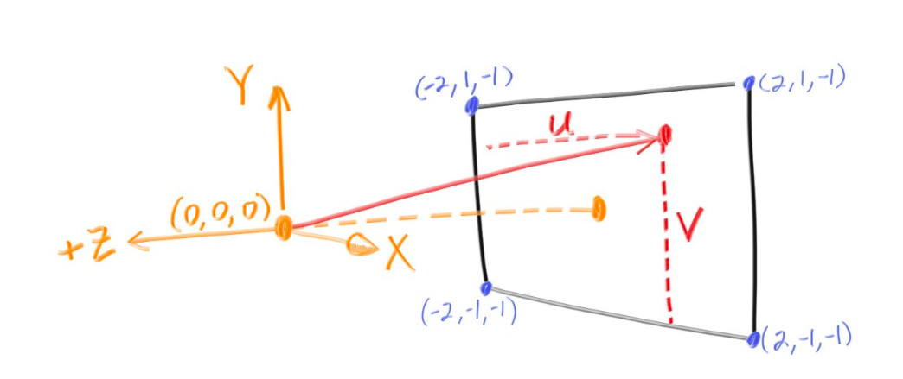
</p>

```cpp
vec3 color(ray& r){
    vec3 origin = r.origin();
    vec3 direction = unit_vector(r.direction());
    float red = 0.5*(float)(direction.x() + 1);
    float green = 0.5*(float)(direction.y() +1);
    float blue = 0.0;
    return vec3(red,green,blue);
}
```

using which with `main()` after setting up the origin and the image dimensions like such:
```cpp
int main(){
    int nx = 200;
    int ny = 100;
    ofstream myfile;
    myfile.open ("image.ppm");
    myfile << "P3\n" << nx << " " << ny << "\n255\n";
    vec3 lower_left_corner(-2.0, -1.0, -1.0);
    vec3 horizontal(4.0, 0.0, 0.0);
    vec3 vertical(0.0, 2.0, 0.0);
    vec3 origin(0.0, 0.0, 0.0);
    for(int j = ny-1; j>=0; j--){
        for(int i=0; i<nx; i++){
            float u = float(i) / float(nx);
            float v = float(j) / float(ny);
            ray r(origin, lower_left_corner + u*horizontal + v*vertical);
            vec3 col = color(r);
            int ir = int(255.99*col[0]);
            int ig = int(255.99*col[1]);
            int ib = int(255.99*col[2]);
            myfile << ir << " " << ig << " " << ib << "\n";
        }
    }
    myfile.close();
}
```
outputs this gradient:

<p style="text-align:center">
    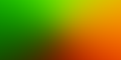
</p>

Notice this part of the code:
`float red = (float)(direction.x() + 1);`. `red` needs to be a value between $0$ and $1$

`direction` is a unit vector hence:

$$
-1 < \text{direction.x()} < 1
$$

$$
0 < \text{direction.x()} + 1 < 2
$$

$$
0 < 0.5(\text{direction.x()} + 1) < 1
$$

## Getting closer to balls: making a sphere

We will now make a sphere, and any ray that hits the sphere will output red color (so, we should be seeing a red sphere on the screen).

A sphere, with centre as $c(x,y,z)$ is parameterised as:

$$
(x-cx)^2 + (y-cy)^2 + (z-cz)^2 = R^2
$$
 
Rewriting this using ray notation, a ray hits a sphere if 

$$
\exists t[(P(t) \cdot x-cx)^2 + (P(t) \cdot y-cy)2 + (P(t) \cdot z-cz)^2 = R^2]
$$

Using vector calculus this translates to:

$$
\exists t[dot((P(t)-c), (P(t)-c)) = R^2]
$$

expanding which becomes:

$$
\exists t[dot(A+t*B-C), dot(A+t*B-C)=R^2]
$$

$$
\implies \exists t[t^2*dot(B, B) + 2t*dot(B, A-C) + dot(A-C, A-C)-R^2=0]
$$

Notice, that the condition is a quadratic equation in t, and is satisfied when the discriminant is non negative.

<p style="text-align:center">
    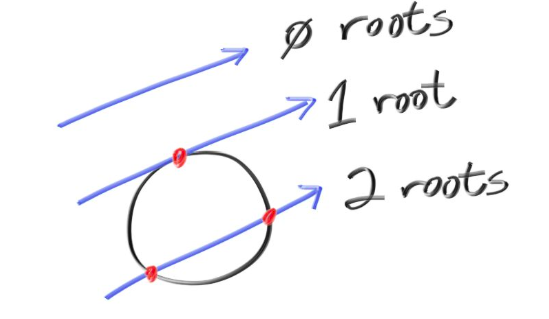
</p>

Hence, I could now create a function with the signature `bool hits_sphere(const vec3& center, float radius, const ray& r)`

```cpp
bool hit_sphere(const vec3& center, float radius, const ray& r){
    vec3 oc  = r.origin() - center;
    float a = dot(r.direction(), r.direction());
    float b = 2.0 * dot(oc, r.direction());
    float c = dot(oc, oc) - radius*radius;
    float discriminant = b*b - 4*a*c;
    return (discriminant > 0);
}
```

and modifying our color function, I output red for any ray hitting the sphere:

```cpp
vec3 color(const ray& r) {
        if(hit_sphere(vec3(0,0,-1), 0.5, r)){
            return vec3(1,0,0);
        }
        vec3 origin = r.origin();
        vec3 direction = unit_vector(r.direction());
        float red = 0.5*(float)(direction.x() + 1);
        float green = 0.5*(float)(direction.y() +1);
        float blue = 0.0;
        return vec3(red,green,blue);
}
```

the `main()` remains unchanged, and the output is:

<p style="text-align:center">
    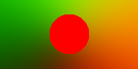
</p>

Yay, it works, but also looks like the Bangladeshi flag which is an aesthetic chocie im not taking to my grave, so i will be using another `color()` that linearly interpolates blue hues depending on the $y$ value:
```cpp
vec3 color(const ray& r) {
        if(hit_sphere(vec3(0,0,-1), 0.5, r)){
            return vec3(1,0,0);
        }
        vec3 unit_direction = unit_vector(r.direction());
        float t = 0.5*(unit_direction.y() + 1.0);
        return (1.0-t)*vec3(1.0, 1.0, 1.0) + t*vec3(0.5, 0.7, 1.0);
}
```
<p style="text-align:center">
    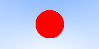
</p>

Much better, but this is still just a... circle, which makes sense bcs this  has fundamentally just projected a sphere onto our screen. But we can use _surface normals_ to give this sphere a sense of shading, and reflection.

## Surface Normals

This is a surface normal:

<p style="text-align:center">
    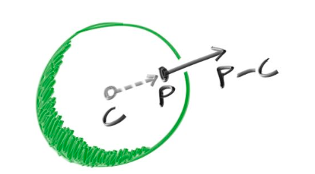
</p>

In code I map each component of the normal to be between 0 and 1 and then correspond them to rgb.

Only those points will be illuminated which are hit by a ray (and for a ray hitting two points, I consider the one closer to the camera, which corresponds to the one with smaller $t$), and so along with a function to tell if a ray hits a sphere, I also need the hit point.

```cpp
float hit_sphere_at_t(const vec3& center, float radius, const ray& r){
    vec3 oc = r.origin() - center;
    float a = dot(r.direction(), r.direction());
    float b = 2.0 * dot(oc, r.direction());
    float c = dot(oc, oc) - radius*radius;
    float discriminant = b*b - 4*a*c;
    if (discriminant < 0) {
        return -1.0;
    }
    else {
        return (-b - sqrt(discriminant) ) / (2.0*a);
    }
}
```

and the `color()` function changes to:
```cpp
vec3 color(const ray& r) {
    float t = hit_sphere_at_t(vec3(0,0,-1), 0.5, r);
    if (t > 0.0) {
        vec3 N = unit_vector(r.point_at_parameter(t) - vec3(0,0,-1)); //(0,0,-1) is the hard coded centre of the sphere
        return 0.5*vec3(N.z()+1, N.x()+1, N.y()+1);
    }
    vec3 unit_direction = unit_vector(r.direction());
    t = 0.5*(unit_direction.y() + 1.0);
    return (1.0-t)*vec3(1.0, 1.0, 1.0) + t*vec3(0.5, 0.7, 1.0);
}
```
(Notice: I correspond xyz to gbr, instead of rgb. This is just an aesthetic choice, you can do anything).

Using the same `main()` this is the output:

<p style="text-align:center">
    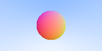
</p>

## Setting up the camera

So far, our "camera", or the point which emits the rays, has been hardcoded within the `main()` function to be at origin. But this can be abstracted to make our camera class. This is my `camera.h` file:

```cpp
#ifndef CAMERAH
#define CAMERAH

#include "ray.h"

class camera {
    public:
        // Default constructor
        camera() {
            // hardcoding the boundaries of our view
            lower_left_corner = vec3(-2.0, -1.0, -1.0);
            horizontal = vec3(4.0, 0.0, 0.0);
            vertical = vec3(0.0, 2.0, 0.0);
            // hardcoding the camera position
            origin = vec3(0.0, 0.0, 0.0);
        }

        // Parameterized constructor
        camera(const vec3& lower_left_corner, const vec3& horizontal, const vec3& vertical, const vec3& origin)
            : lower_left_corner(lower_left_corner), horizontal(horizontal), vertical(vertical), origin(origin) {}

        // Outputs a ray for a pixel
        ray get_ray(float u, float v) const {
            return ray(origin, lower_left_corner + u * horizontal + v * vertical - origin);
        }

        vec3 origin;
        vec3 lower_left_corner;
        vec3 horizontal;
        vec3 vertical;
};
#endif

```

I could now change our `main()` to use a camera object:

```cpp
int main(){
    int nx = 200;
    int ny = 100;
    ofstream myfile;
    myfile.open ("image.ppm");
    myfile << "P3\n" << nx << " " << ny << "\n255\n";
    camera cam;
    for(int j = ny-1; j>=0; j--){
        for(int i=0; i<nx; i++){
            float u = float(i) / float(nx);
            float v = float(j) / float(ny);
            ray r = cam.get_ray(u, v);
            vec3 col = color(r);
            int ir = int(255.99*col[0]);
            int ig = int(255.99*col[1]);
            int ib = int(255.99*col[2]);
            myfile << ir << " " << ig << " " << ib << "\n";
        }
    }
    myfile.close();
}
```
This outputs the same sphere I had previously gotten, but now I also have the ability to use the parametrised constructor from the camera class to change the camera positions and view boundaries from within the `main()` function.

For example: The sphere is centered at $(0, 0, -1)$ (notice the parameters to `hit_sphere_at()`), with radius $=0.5$ and our camera is at $(0, 0, 0)$ but if I move the camera to $(0, 0, -0.4)$ the rendered sphere should appear larger as it is closer. And that does happen:
`camera cam(vec3(-2.0, -1.0, -1.0), vec3(4.0, 0.0, 0.0), vec3(0.0, 2.0, 0.0), vec3(0.0, 0.0, -0.4));` outputs:

<p style="text-align:center">
    
</p>

We could also place the camera "behind" the sphere by making $z=-2$, this should output a sphere of the same size, since the distance between the camera and the centre of the sphere is still 1 units, but the color should be different since different normals are being rendered. And voila:

<p style="text-align:center">
    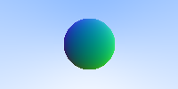
</p>


### A subtle bug appears

So far, our code seems to be working correctly. But, what if we place the camera _INSIDE_ the surface of the sphere? Let's change the camera position to be $(0,0,-0.6)$. We would expect that the entire view of the camera would be covered by the sphere and we should see the gradient corresponding to the inner surface normals. The image rendered is:

<p style="text-align:center">
    
</p>

This is strange, the sphere isn't rendered at all, and all we see is the background. This means that our rays are somehow passing _through_ the sphere as if it were transparent. Let's try to fix this. 

Notice that the `hit_sphere_at_t()` funtion, in case of 2 real solutions for `t` outputs the smaller one:

```cpp
return (-b - sqrt(discriminant) ) / (2.0*a); //only using '-' instead of '+-'
```

And in the case when the camera is inside the sphere, there exists a point where the ray hits the sphere that lies "behind" the camera, corresponding to a _negative `t`_ value which is also the smaller solution and hence a _negative_ value is outputed by the function.

Now notice that the `color()` function only detects a collision when the `t` value outputed by the `hit_sphere_at_t()` is positive. This works fine when camera is outside because then the `color()` function correctly filters out the non colliding rays which correspond to a -1 value in `hit_sphere_at_t()`.

Now that I identified the bug, the fix is simple: change the if condition to:
`if (t != -1.0)` since this filters out only those rays which are non colliding (it could also potentially filter out the rays for which the smaller solution is -1 but that number is negligible, and the work around to that would to have the `hit_sphere_at_t()` function output something like `INT_MIN()` for non collisions and update the if condition accordingly.)

Let's look at our new render now:

<p style="text-align:center">
    
</p>

Much better. If you keep the camera _on_ the sphere, the code still works and outputs the expect solid color corresponding to the normal of the point on which the camera is placed.

(NOTE: with this bug fix approach we are basically allowing the camera to look "behind" itself, which might or might not be what you want depending on how realistic you want your renders to be, i found that this allows for some funky render possibilities so I let it be, for a more realistic fix, just change the function to return the smallest _positive_ $t$ value.)

### Another bug (when will i catch a break)

Look what happens if I place my camera at $(0,1,-1)$ which is also 1 unit away from the centre:

<p style="text-align:center">
    
</p>

This is very cool! We seem to be generating a cone. Actually, it's much cooler, we are generating conical sections, as plane slices on the sphere at different angles. This is because (so far) our camera cannot turn and only outputs light upto the corners of its view (as opposed to in all directions). This causes the sphere to be sectioned of the a plane not perpendicular to the camera. 

So, the bug wasn't that bad after all, but to fix it we will need to allow the camera to rotate about it's axes (imagine moving your face while keeping your noise stationary)

## More work on the camera class:

FOV is field of view, which tells us how much our camera can see. Until now the FOV had been defined by `lower_left_corner`, `vertical` and `horizontal`. When you squint your eyes, your fov decreases.

Now, we will define two parameters to the camera constructor:
`vfov` which is the angle between the $xz$ plane and the fov plane which is perpendicular to $yz$ plane, and `aspect` which is the ratio between the height and width of our field of view.

Let's update our camera class:

```cpp
#ifndef CAMERAH
#define CAMERAH

#include "ray.h"

class camera {
    public:
        camera(float vfov, float aspect) { // vfov is top to bottom in degrees
            float theta = vfov*M_PI/180;
            float half_height = tan(theta/2);
            float half_width = aspect * half_height;
            lower_left_corner = vec3(-half_width, -half_height, -1.0);
            horizontal = vec3(2*half_width, 0.0, 0.0);
            vertical = vec3(0.0, 2*half_height, 0.0);
            origin = vec3(0.0, 0.0, 0.0);
        }
        ray get_ray(float u, float v) {
            return ray(origin,
                        lower_left_corner + u*horizontal + v*vertical - origin);
        }

        vec3 origin;
        vec3 lower_left_corner;
        vec3 horizontal;
        vec3 vertical;
};
#endif
```

The only change is that `vertical`, `lower_left_corner`, and `horizontal` are now functions of the parameters, rather than being paramteres themselves. 

Using `camera cam(90, float(nx)/float(ny))` outputs the following image, which we have seen before:

<p style="text-align:center">
    
</p>

But reducing the field of view by keeping `vfov` (verticle fov) to be 40 degrees, we can only see some part of the sphere:

<p style="text-align:center">
    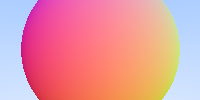
</p>

Great, but our camera still can't rotate. Let's change that.

The approach I adopted is standard in computer graphics and camera transformations.

To the constructor I added take two points (vec3 values) `lookfrom` and `lookat` and return a camera object located at `lookfrom` and positioned towards `lookat`-`lookfrom`. But there is one more degree of freedom: the roation about the `lookat`-`lookfrom` axis, this we calculate this using `vup`. Usually, `vup` is $(0,1,0)$, but notice that `vup` is not necessarily perpendicular to the `lookat`-`lookfrom` axis. 

Which means we have 2 (not necessarily perpendicular) linearly independant vectors, and we want to create the corresponding orthonormal basis. This basis is unique and can we calculated using thr _Gram-Schmidt process_.

The math is better understood, when not explained by me:
https://math.ryerson.ca/~danziger/professor/MTH141/Handouts/gram.pdf

https://math.berkeley.edu/~arash/54/notes/6_4.pdf

https://people.tamu.edu/~yvorobets//MATH304-2011A/Lect3-05web.pdf

https://www.youtube.com/watch?v=zHbfZWZJTGc

Turning this into code, this is our new `camera.h` file:

```cpp
#ifndef CAMERAH
#define CAMERAH

#include "ray.h"

class camera {
    public:
        camera(vec3 lookfrom, vec3 lookat, vec3 vup, float vfov, float aspect) {
            vec3 u, v, w;
            float theta = vfov*M_PI/180;
            float half_height = tan(theta/2);
            float half_width = aspect * half_height;
            origin = lookfrom;
            w = unit_vector(lookfrom - lookat);
            u = unit_vector(cross(vup, w));
            v = cross(w, u);
            lower_left_corner = origin - half_width*u - half_height*v - w;
            horizontal = 2*half_width*u;
            vertical = 2*half_height*v;
        }
        ray get_ray(float s, float t) {
            return ray(origin,
                        lower_left_corner + s*horizontal + t*vertical - origin);
        }

        vec3 origin;
        vec3 lower_left_corner;
        vec3 horizontal;
        vec3 vertical;
};
#endif
```

This video is a good visualiser: https://www.youtube.com/watch?v=G6skrOtJtbM&ab_channel=Udacity

This is the output using 
```cpp
camera cam(vec3(-2,2,1), vec3(0,0,-1), vec3(0,1,0), 90, float(nx)/float(ny));
```

<p style="text-align:center">
    
</p>

You could try changing vup but bcs of how completely symmetric a sphere is the only change will be in the normals, not the shape.

To zoom in let's reduce the FOV to 15:

<p style="text-align:center">
    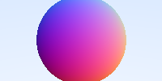
</p>

## What else can we do with the current setup?

Theoretically, since we can render spheres we can render any volume by rendering lots of small spheres. This is a mix between point clouds and voxels. But that is a WILDLY inefficient and inelagant way to do it, and i just mentioned it for a gag.

We can render any surface with the equation 

$$
f(x,y,z)=s
$$

by analysing it's intersecetions with a ray

$$
x=A_x + t*B_x
$$

$$
y=A_y + t*B_y
$$

$$
z=A_z + t*B_z
$$

as long as we are able to find solutions to:

$$
f(A_x + t*B_x, A_y + t*B_y, A_z + t*B_z) = s
$$

For all the following curves, I have centered them at $(0,0,0)$ and moved the camera elsewhere. This is just to make the code look cleaner.

### Cylinder

$$
x^2+y^2=R^2
$$

$$
\implies (A_x+t*B_x)^2 + (A_y+t*B_y)^2 - R^2=0
$$

$$
\implies t^2*(B_x^2+B_y^2)+t*(2A_x B_x + 2A_y B_y) + (A_x^2 + A_y^2-R^2)=0
$$

This is quadratic in $t$ so we will follow the approach we did in spheres. I wrote `hit_cylinder_at_t()` and `colorCylinder()` like follows, and used `colorCylinder()` in `main()`:

```cpp
float hit_cylinder_at_t(const vec3& center, float radius, const ray& r){
    vec3 oc = r.origin() - center;
    vec3 direction = r.direction();
    float bx = dot(direction, vec3(1,0,0));
    float by = dot(direction, vec3(0,1,0));
    float bz = dot(direction, vec3(0,0,1));
    float ax = dot(oc, vec3(1,0,0));
    float ay = dot(oc, vec3(0,1,0));
    float az = dot(oc, vec3(0,0,1));
    float a = bx*bx + by*by;
    float b = 2.0f * (ax*bx + ay*by);
    float c = ax*ax + ay*ay - radius * radius;
    float discriminant = b * b - 4.0f * a * c;

    if (discriminant < 0) {
        return -1.0f;
    } else {
        return (-b - sqrt(discriminant)) / (2.0f * a);
    }
}
```

and

```cpp
vec3 colorCylinder(const ray& r) {
    float t = hit_cylinder_at_t(vec3(0,0,-1), 0.5, r);
    if (t != -1) {
        vec3 N = unit_vector(r.point_at_parameter(t) - vec3(0,0,-1));
        return 0.5*vec3(N.z()+1, N.x()+1, N.y()+1);
    }
    vec3 unit_direction = unit_vector(r.direction());
    t = 0.5*(unit_direction.y() + 1.0);
    return (1.0-t)*vec3(1.0, 1.0, 1.0) + t*vec3(0.5, 0.7, 1.0);
}
```
outputs:

<p style="text-align:center">
    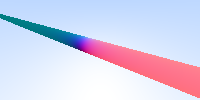
</p>

Yay, it works, now let's make a finite cylinder by only using those $t$'s for which the $z$ value is between $z_max$ and $z_min$, and if 2 values of $t$ satisfy this we return the smaller value. The updated `hit_cylinder_at_t()` looks like:
```cpp
float hit_cylinder_at_t(const vec3& center, float radius, float z_min, float z_max, const ray& r){
    vec3 oc = r.origin() - center;
    vec3 direction = r.direction();
    float bx = dot(direction, vec3(1,0,0));
    float by = dot(direction, vec3(0,1,0));
    float bz = dot(direction, vec3(0,0,1));
    float ax = dot(oc, vec3(1,0,0));
    float ay = dot(oc, vec3(0,1,0));
    float az = dot(oc, vec3(0,0,1));
    float a = bx*bx + by*by;
    float b = 2.0f * (ax*bx + ay*by);
    float c = ax*ax + ay*ay - radius * radius;
    float discriminant = b * b - 4.0f * a * c;

    if (discriminant < 0) {
        return -1.0f;
    } else {
        float t0 = (-b - sqrt(discriminant)) / (2.0f * a);
        float t1 = (-b + sqrt(discriminant)) / (2.0f * a);

        float z0 = dot(r.point_at_parameter(t0), vec3(0,0,1));
        float z1 = dot(r.point_at_parameter(t1), vec3(0,0,1));

        if (z0 > z_min && z0 < z_max) {
            return t0;
        } else if (z1 > z_min && z1 < z_max) {
            return t1;
        } else {
            return -1.0f;
        }
    }
}
```
and this outputs:

<p style="text-align:center">
    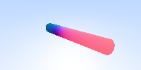
</p>

### Cone

To render a cone, we can follow a similar approach as we did for the cylinder. For a cone with its vertex at $(0,0,0)$ and its axis aligned along the $z$-axis, we can use the equation:

$$
x^2 + y^2 = (z\div h)^2 R^2
$$

where $R$ is radius of base, and $h$ is height

$$
\implies \left(A_x + t B_x\right)^2 + \left(A_y + t B_y\right)^2 = \left(\frac{A_z + t B_z}{h}\right)^2R^2
$$

$$
\implies t^2 \left(B_x^2 + B_y^2 - \frac{R^2 B_z^2}{h^2}\right) 
+ t \left(2A_x B_x + 2A_y B_y - \frac{2 R^2 A_z B_z}{h^2}\right) 
+ \left(A_x^2 + A_y^2 - \frac{R^2 A_z^2}{h^2}\right) = 0
$$

This is quadratic in $t$ so using the approach we have used so far, we will define `hit_cone_at_t()` and `colorCone()`

```cpp
float hit_cone_at_t(const vec3& center, float radius, float height, const ray& r) {
    vec3 oc = r.origin() - center;
    vec3 direction = r.direction();

    float bx = dot(direction, vec3(1,0,0));
    float by = dot(direction, vec3(0,1,0));
    float bz = dot(direction, vec3(0,0,1));
    float ax = dot(oc, vec3(1,0,0));
    float ay = dot(oc, vec3(0,1,0));
    float az = dot(oc, vec3(0,0,1));

    float k = radius / height;
    float k2 = k * k;

    float a = bx*bx + by*by -k2*bz*bz;
    float b = 2*(ax*bx + ay*by - k2*az*bz);
    float c = ax*ax + ay*ay - k2*az*az;

    float discriminant = b * b - 4.0f * a * c;

    if (discriminant < 0) {
        return -1.0f; // No intersection
    } else {
        float sqrt_disc = sqrt(discriminant);
        float t0 = (-b - sqrt_disc) / (2.0f * a);
        float t1 = (-b + sqrt_disc) / (2.0f * a);

        return t0;
        
        // float z0 = dot(r.point_at_parameter(t0), vec3(0,0,1));
        // float z1 = dot(r.point_at_parameter(t1), vec3(0,0,1));
        
        // bool t0_valid = (z0 >= z_min && z0 <= z_max);
        // bool t1_valid = (z1 >= z_min && z1 <= z_max);
        
        // if (t0_valid && t1_valid) {
        //     return min(t0, t1); // Return the closest valid intersection
        // } else if (t0_valid) {
        //     return t0;
        // } else if (t1_valid) {
        //     return t1;
        // } else {
        //     return -1.0f; // No valid intersection within bounds
        // }
    }
}
```

This outputs a double cone, corresponding to positive and negative $t$'s. We can change this by using `z_max` and `z_min` like we did for cylinder (code in comments, add 2 remaining parameters to the function).

The `colorCone()` function is nearly identical. You can find it on the GitHub repo.

<p style="text-align:center">
    
</p>

### Torus
Can be implemented similar to what we have done so far, but the final equation in $t$ is quartic (degree 4), which makes sense since a ray can intersect a torus at max 4 times. I am, for now, too tired to type out the math and the code, but it can be done lol. I'll try to add it soon.

For now: find the math here https://www.cl.cam.ac.uk/teaching/1999/AGraphHCI/SMAG/node2.html
 and a more involved piece here http://cosinekitty.com/raytrace/chapter13_torus.html 


### Ok I'm so tired now. I'll update it soon or post a part 2. 

I thought i'd render more interesting shapes, but I tried solving the ray collision equation for two shapes and this was the output:

<p style="text-align:center">
    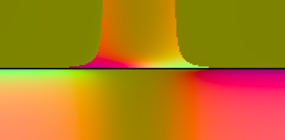
</p>

idk 

Here are the things im working on: creating perlin noise textures, making the code more modular and add things like material properites (think metal vs glass vs water droplet), writing a GPU usable version of the tracer, and rendering these surfaces: https://www.imaginary.org/gallery/herwig-hauser-classic


For shits and giggles here is the render I made following Shirley's blog, which we are about 3 classes away from making. It took about 35 mins to render on my slow ass Intel MacBook Air:

<p style="text-align:center">
    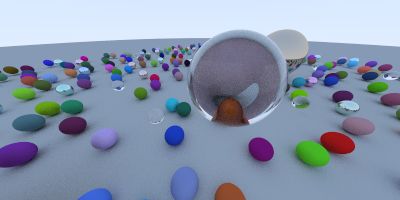
</p>

Thanks for reading so far (or skipping to the end, id do the same trust me). If you want to reach out w ideas, bugs, imporvements or to just chat wish it upon a star that we cross paths (or open a pull request, or write to me at utkarshzee@gmail.com)

